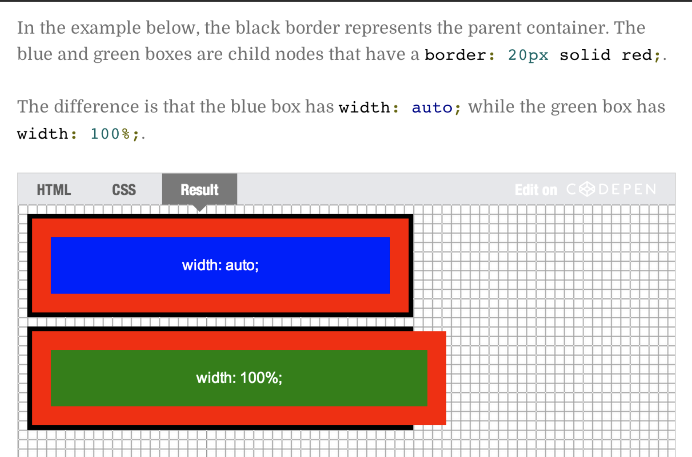

#### What is a `Responsive Web Site`?

- Site designed to adapt its layout to the viewing environment by using fluid, proportion-based grids, flexible
  images, and CSS# media queries
- Site's layout adapts to the size of the device.
- Content verbosity or its visual delivery may change.

#### Combining selectors

- Element with class selectors (selector.class)
- Child (direct) selector (selector > selector)
- Descendent selector (selector selector)

#### Pseudo-Class Selector

- :link
- :visited
- :hover
- :active
- :nth-child(...)

#### What iss the difference between `width: auto` and `width: 100%` in CSS?

- **width: auto** will try as hard as possible to keep an element the same width as its parent container when additional space is added from margins, padding, or borders.

- **width: 100%** will make the element as wide as the parent container. Extra spacing will be added to the element's size without regards to the parent. This typically causes problems.

  

#### Box Model

- Essential to understand
  - Prefer `box-sizing: border-box`; // `box-sizing: content-box`;
  - `border-box` = The elements should have padding and border included in the element's total width and height.
  - `content-box` = The `padding` and `border` properties includes (add) with the `width`.
- The \* (Universal) selector
- Cumulative and collapsing margins
  - Horizontal margins are cumulative (addition)
  - Vertical margins are collapsing (take larger one)
- Content overflow
  - overflow - visible (default), auto (scroll bar), hidden (cut the text outside box)

#### CSS Specificity Value

- Style attribute
- ID
- Class, psuedo-class, attribute
- Elements

**N.B:** top to bottom -> most-specificity to least-specificity

See [CSS specificity calculator](https://specificity.keegan.st/)

## CSS Position

- Five position types: *static*(default), *relative*, *absolute*, *fixed*, *sticky*
- Elements with static type is a **non-positioned element**. Other ones are **positioned elements**. We can use **LTRB properties + z-index** on positioned elements. **Absolute** type is positioned with respect to it's closed positioned ancestor
- **Static** & **relative** are positioned according to normal flow of the document. **Absolute** & **fixed** are removed from the normal document flow. **Sticky** is within the normal flow, until it reaches it's constraint.
#### Relative and Absolute Position

- Relative positioning offsets the element relative to its normal document flow position
- Absolute positioning is relative to closest ancestor which has positioning set to non-static value
- Offset the relative container element offsets its contents as well.

#### Sticky Position

- Element is first positioned with the normal flow of the document (like static & relative), **then** it is offset with respect to its nearest scrolling ancestor and containing block depending on its **LTRB properties.**
- Can think of its as a hybrid of **relative and fixed** positioning. *The element is treated as relative positioned until it crosses a specified threshold, at which point it is treated as fixed positioned.*
- **LTRB properties** are offsets from its containing parent block element and scrolling ancestor that are used to **constrain** the stickied element within its parent and scrolling ancestor
- Without **LTRB properties,** it behaves like the relative type.

#### Positioning Elements by Floating

- Floating elements can produce very flexible layouts
- Floats are taken out of normal document flow
- Floats don't have vertical margin collapse
- To resume normal document flow, use the `clear` property.
  - clear: left/right/both

## Responsive design

#### Which meta tag should be added for responsive design?

The `viewport` meta tag should be added.

```js
<meta name="viewport" content="width=device-width, initial-scale=1.0">
```

This gives the browser instructions on how to control the page's dimensions and scaling.

- The `width=device-width` part sets the width of the page to follow the screen-width of the device (which will vary depending on the device).

- The `initial-scale=1.0` part sets the initial zoom level when the page is first loaded by the browser.

#### @media Queries

- Basic syntax of a media query
  - @media (media feature)
  - @media (media feature) logical operator (media feature)
- Remember not to overlap breakpoints
- Usually, we should provide base styling
  - Then, change or add to then in each media query
- What is `Bootstrap` ?
- Bootstrap is the most popular HTML, CSS, and JS framework for developing responsive, mobile first projects on the web.


#### Viewport vs Media Queries

- Viewport
  - Adjust site to device viewport
  - No design changes
- Media Queries
  - Change design depending on size
  - Design changes define by us

#### Bootstrap Grid System

- Structure Bootstrap expects for the grid-based layout
  - Needs to be include .container (or .container-fluid)
  - All columns must be inside .row
- `SIZE` identifier identifies at which breakpoint specified column spans will be ignored and all elements will collapse (i.e., stack)
- If no other rules apply, specifying `col-xs-..` will keep that layout no matter what the size of the screen.

```
/********* Base styles ****************/
    #p1 {
      background-color: #A52A2A;
      width: 300px;
      height: 300px;
    }
    #p2 {
       background-color: #DEB887;
       width: 50px;
       height: 50px;
    }

/*********** Large device only ****************/
@media (min-width: 1200px)
    #p1 {
      width: 80%;
    }
    #p2 {
      width: 150px;
      height: 150px;
    }
/****************  Medium device only   *******************/
@media (min-width: 768px) and (max-width: 991px)
    #p1 {
      width: 50%;
    }
    #p2 {
      width: 100px;
      height: 100px;
    }
```

## Combinators

#### Adjacent Sibling

- Elements share the same parent
- Second element comes `immediately` after first element

```css
h2 + p {
  color: red;
}
```

```html
<div>
  <h2>Not applied</h2>
  <p>CSS applied</p>
  <h2>Not applied</h2>
  <h3>Not applied</h3>
  <p>Not applied</p>
  <h2>Not applied</h2>
  <p>CSS applied</p>
</div>
```

#### General Sibling

- Elements share the same parent
- Second element comes after first element

```css
h2 ~ p {
  color: red;
}
```

```html
<div>
  <h2>Not applied</h2>
  <p>CSS applied</p>
  <h2>Not applied</h2>
  <h3>Not applied</h3>
  <p>CSS applied</p>
</div>
```

#### Child Combinator

- Second element is a direct child of first element

```css
div > p {
  color: red;
}
```
```html
<div>
  <h2>Not applied</h2>
  <p>CSS applied</p>
  <div>Not applied</div>
  <article>
    <p>Not applied</p>
  </article>
  <p>CSS applied</p>
</div>
```

#### Decendant Combinator

- Second element is a descendant of the first element

```css
div p {
  color: red;
}
```
```html
<div>
  <h2>Not applied</h2>
  <p>CSS applied</p>
  <div>Not applied</div>
  <article>
    <p>CSS applied</p>
  </article>
  <p>CSS applied</p>
</div>
```

## CSS Questions and Answers

#### How can we disable a link?

```css
.inactive-link {
  color: black;
  text-decoration: none;
  pointer-events: none;
  pointer: default;
}
```

#### How to disable resizing of textarea?

```css
textarea {
  resize: none;
}
```

#### How to change placeholder's color?

```css
::placeholder {
  color: cyan;
}
```

#### How to unordered list with bullets

```css
ul {
  list-style-type: none;
}
```

#### Disable Text Selection

```css
.non-select-element {
  user-select: none;
}
```

#### How to make a image fit

```css
img {
  width: 100%;
  height: 100%:
  object-fit: contain;
}
```

## Mixin

```
// select all the selectors and apply this instead of inheritance
* {
  box-sizing: border-box;
}

// as box-sizing don't be inheritenced so it doesn't work for child of body tag
body {
 box-sizing: border-box;
}
```
