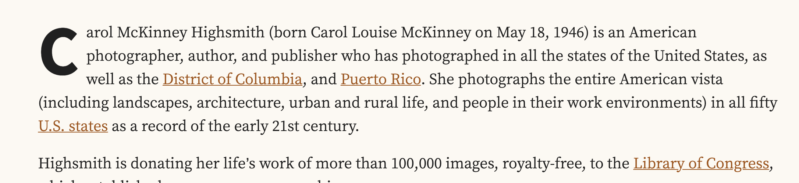

## CSS Questions and Answers

### What is the difference between `ems` and `rems`?

`em` and `rem` are the two _relative lengths_ we're likely to encounter most frequently when sizing anything from boxes to text.

- the `em` unit means **"my parent element's font-size"**

- the `rem` unit means **"The root element's font-size"**.

### How to inspect `dropdown` element and change css?

One way is to inspect the element is to prevent the `blur event` from being triggered is by removing the blur event listener!

1. Inspect the dropdown input element in chrome browser
2. Go to 'Event Listeners' then remove `blur` event, done!

### What is a `clearfix` and why need this?

A `clearfix` is a way for an element to clear its child elements automatically without any additional markup. The clearfix property is generally used in **float layouts where elements are floated to be stacked horizontally**.

The clearfix property allows a container to wrap its floated children. Without a clearfix, a container will not wrap around its floated children and will collapse, just as if its floated children had been positioned absolutely.

```css
.clearfix:after {
  content: '';
  display: table;
  clear: both;
}
```

### How can we disable a link?

```css
.inactive-link {
  color: black;
  text-decoration: none;
  pointer-events: none;
  pointer: default;
}
```

### How to disable resizing of textarea?

```css
textarea {
  resize: none;
}
```

### How to change placeholder's color?

```css
::placeholder {
  color: cyan;
}
```

### How to unordered list with bullets

```css
ul {
  list-style-type: none;
}
```

### Disable Text Selection

```css
.non-select-element {
  user-select: none;
}
```

### Deep Dive into `object-fit` and `background-size`

**Object-fit** - property defines how the content of a replaced element such as `img` or `video` should be resized to fit its container. The default value for `object-fit is fill`, which can result in an image squeezed or, stretched.

- `object-fit: contain` resize the image to fit the aspect ration of its container. if the image's aspect ration doesn't match the container's, it will be either `letterboxed` or resized accordingly

- `object-fit: cover` resize the image to fit the aspect ratio of its container, and if the image's aspect ratio doesn't match the container's, then it will be clipped to fit.

- `object-fit: fill (default)` resize the aspect ration of its container, and if the image's aspect ration doesn't match the container's, it will be either `squeezed or stretched`

- `object-fit: none` won't resize the image


**background-size** - the first difference is that we're dealing with the background, not an HTML (`img`) element.

- `background-size: auto`: will keep the image at its default size

- `background-size: cover`: if the aspect rations are not the same, then the image will be masked to fit

- `background-size: contain`: if the aspect rations are not the same, then the image will be letterboxed

### How to make a image fit

```css
img {
  width: 100%;
  height: 100%:
  object-fit: contain;
}
```

### Drop Cap Letter

We might have seen some blogs with the `first letter being huge` and the text is wrapped around it. That can be achieved with this simple trick on your text block.

```css
.has-dropcap:first-letter {
  font-family: 'Source Sans Pro', Arial, Helvetica, sans-serif;
  float: left;
  font-size: 6rem;
  line-height: 0.65;
  margin: 0.1em 0.1em 0.2em 0;
}
```

```html
<p class="has-dropcap">
  Carol McKinney Highsmith (born Carol Louise McKinney on May 18, 1946) is an
  American photographer, author, and publisher who has photographed in all the
  states of the United States, as well as the ....... as a record of the early
  21st century.
</p>
```



### How to Display a Link When the Element has No Text But the Href Attribute Has a Link?

```css
a[href^='http']:empty::before {
  content: attr(href);
}
```

### How to Change Selection Text Color?

Most of the time when you visit any site and try to copy some text, it is just the `blue` color selection with `white` text. We can easily change the color using `selection pseudo-class`.

```css
::selection {
  background-color: #f8e71c;
  color: #000;
}
```

### How to find an element that is causing the showing of horizontal scrolling in browser?

```css
.slide-content .scroller {
  width: 1024px;
}
```

The fastest way to add this in inspector:

```css
* {
  outline: 1px solid #f00 !important;
}
```
