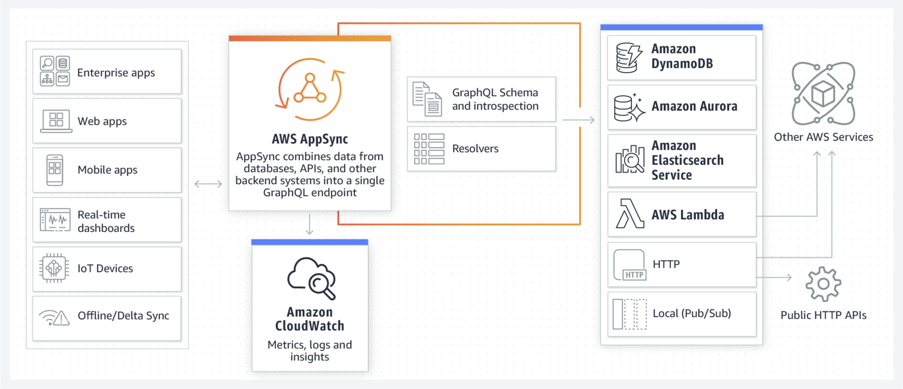
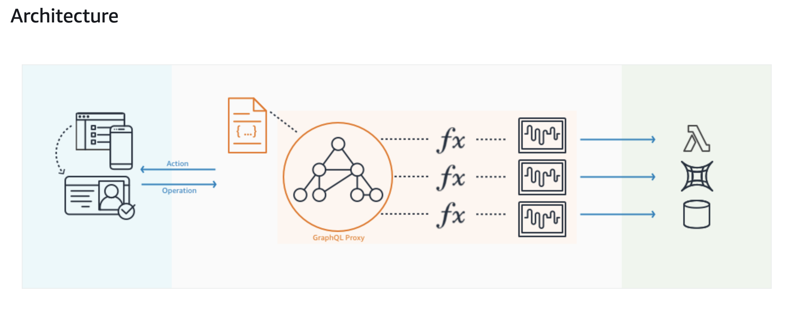

## AppSync Overview
### What is AWS AppSync?

It accelerate application development with scalable GraphQL APIS.

Organizations choose to build APIs with GraphQL because it helps them develop applications **faster, by giving front-end developers the ability to query multiple databases, microservices, and APIs with a single GraphQL endpoint**.

### What is the Benefits of using AWS AppSync?

- `Simple and secure data access`: Power your applications with the right data, from one or more data sources with a single network request using GraphQL

- `Built-in real-time & offline capabilities`: With managed GraphQL subscriptions, AWS AppSync can push real-time data updates over Websockets to millions of clients.

- `No servers to manage`: AWS AppSync offers fully managed GraphQL API setup, administration, and maintenance, with high-availability serverless infrastructure built in.

### How It Works?

GraphQL APIs built with AWS AppSync give front-end developers the ability to query multiple databases, microservices, and APIs from a single GraphQL endpoint. 

### Features of AWS AppSync?

AWS AppSync includes a variety of features to make building GraphQL a streamlined experience:

- Powerful GraphQL schema `editing through the AWS AppSync console`, including automatic GraphQL schema generation from DynamoDB
- Streamlined data caching
- Integration with Amazon Cognito user pools for `fine-grained access control` at a per-field level.

## System Overview and Architecture

AWS AppSync enables developers to interact with their data by using a managed GraphQL service. GraphQL offers many benefits over traditional gateways, encourages declarative coding style, and works seamlessly with modern tools and frameworks, including React, React Native, iOS, and Android.

### GraphQL Proxy

A component that runs the GraphQL engine for processing requests and mapping them to logical functions for data operations or triggers. The data resolution process performs a batching process (called the Data Loader) to your data sources. This component also manages conflict detection and resolution strategies.

### Operation

AWS AppSync supports the three GraphQL operations: query (read-only fetch), mutation (write followed by a fetch), and subscription (long-lived requests that receive data in response to events).

### Action

There is `one action` that AWS AppSync defines. This action is a notification to connected subscribers, which is the result of a mutation. Clients become subscribers through a handshake process following a GraphQL subscription.

### Data Source

A persistent storage system or a trigger, along with credentials for accessing that system or trigger. Your application state is managed by the system or trigger defined in a data source. Examples of data sources include NoSQL databases, relational databases, AWS Lambda functions, and HTTP APIs.

### Resolver

A function that `converts the GraphQL payload` to the underlying storage system protocol and executes if the caller is `authorized` to invoke it. Resolvers are comprised of `request and response mapping templates`, which contain **transformation and execution logic**.

### Unit Resolver

A unit resolver is a resolver that performs a `single operation` against a `predefined` data source.

### Pipeline Resolver

A pipeline resolver is a resolver that allows `executing multiple operations` against one or more data sources. A pipeline resolver is composed of a list of functions. Each function is executed `in sequence and can execute a single operation` against a predefined data source.

### Function

A function defines a `single operation that can be used across pipeline resolvers`. Functions can be `reused` to perform redundant logic throughout the GraphQL Proxy. Functions are comprised of a request and a response mapping template, a data source name, and a version.

### Identity

A representation of the caller based on a set of credentials, which must be sent along with every request to the GraphQL proxy. It `includes permissions to invoke resolvers`. Identity information is also `passed as context to a resolver and the conflict handler` to perform additional checks.
