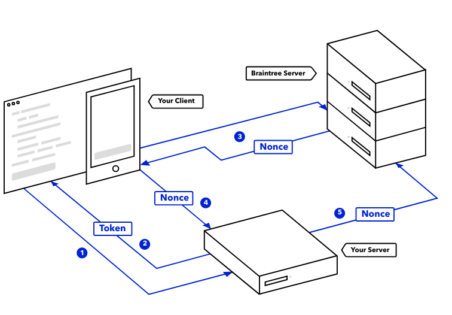

#### How it works

1. Your app or web front-end `requests a client token` from your server in order to initialize the client SDK
2. Your server `generates and sends a clilent token back to your client` with the server SDK
3. Once the client SDK is initialized and the customer has submitted payment information, the SDK communicates that information and returns a `payment method nonce`
4. You then `send the payment method nonce to your server`
5. Your server code `receives the payment method nonce from your client` and then uses the server SDK to `create a transaction` or perform other functions detailed in the guides.

    

