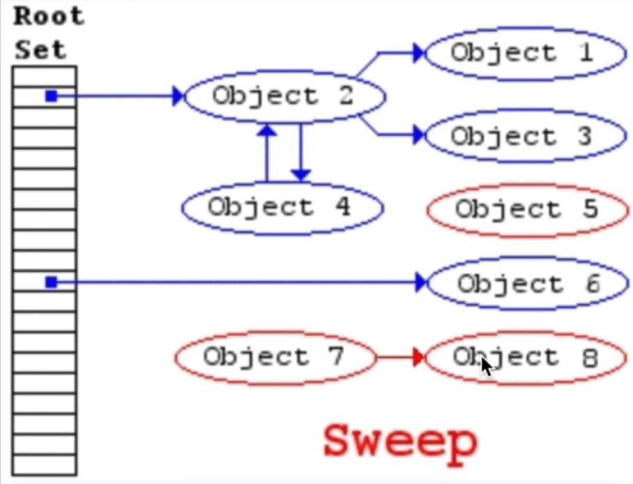

## JavaScript Engine Workflow

1. JS file pass through Lexical analysis (Parser)
    - Breaks the code into token


    


2. Token generates a AST (Abstract Syntax Tree)
    - go to https://astexplorer.net
3. Pass the AST to Interpreter and output is binary

### What can be problematic for JavaScript Engine

- eval()
- arguments()
- for..in
- with
- delete
 
Tips: always write optimize code that is predictable!

## Memory Heap vs Call Stack

`Memory Heap`: where the memory allocation happens - allocate memory, use memory, release memory
`Call Stack`: keep track where we are in the code so that we can run the codes in order

## How does garbage collection actually works in JavaScript?

- Use [**Mark-and-Sweep**](https://www.geeksforgeeks.org/mark-and-sweep-garbage-collection-algorithm/) algorithm



## What is Memory Leaks?

When `Memory Heaps` is full  (no `garbage collection` is happening, it is called **Memory Leaks**. When memory leaks happens the browser will be crashed!

```js
let array = [];

// infinite loop, memory leaks
for (let i = 2; i > 1; i++) {
  array.push(i);
}

// Event listeners
const element = document.getElementById("button");
element.addEventListener("click", onClick);
// if we back and forth specially in single page application and don't remove event listeners
// then it causes memory leaks

// setInterval
setInterval(() => {
  // referencing  objects...
})

```

## What is Polyfill?

[Polyfill](https://polyfill.io/v3/) is a service which accepts a request for a set of browser features and returns only the polyfills that are needed by the requesting browser

#### Plyfill Necessity

There are lots of differing browsers and browser versions in use throughout the world, each one has a slighly different set of features to the rest. This can make developing for browsers a difficult task. The latest versions of the popular browsers can do lots of things which older browsers can not – but you may still have to support the older browsers. Polyfill.io makes it simpler to support differing browsers by attempting to recreate the missing features with polyfills: You can make use of the latest and greatest features in browsers which support them, and in those that do not.

`Two` interesting polyfills are:

- [core](https://github.com/zloirock/core-js) js that supports a lot, allows to include only needed features.

- [polyfill.io](https://polyfill.io/v3/) service that provides a script with polyfills, depending on the features and user’s browser.


## What is Babel?

[Babel](https://babeljs.io/) is a [transpiler](https://en.wikipedia.org/wiki/Source-to-source_compiler). It rewrites modern JavaScript code into the previous standard.

When we use modern features of the language, some engines may fail to support such code. Just as said, not all features are implemented everywhere. Here, Babel comes to the rescue.

#### Two Parts of Babel

1. First, the transpiler program, which rewrites the code. The developer runs it on their own computer. It rewrites the code into the older standard. And then the code is delivered to the website for users. Modern project build system like [webpack](http://webpack.github.io/) provide means to run transpiler automatically on every code change, so that very easy to integrate into development process.

2. New language features may include new built-in functions and syntax constructs. The transpiler rewrites the code, transforming syntax constructs into older ones. But as for new built-in functions, we need to implement them. JavaScript is a highly dynamic language, scripts may add/modify any functions, so that they behave according to the modern standard.

[Reference](https://javascript.info/polyfills?fbclid=IwAR0c0kkaS24PRX2TKgWajNF9w0vQ8qmt2LhpXqJcdvl7JfIDL-sa5ghXdrg)
