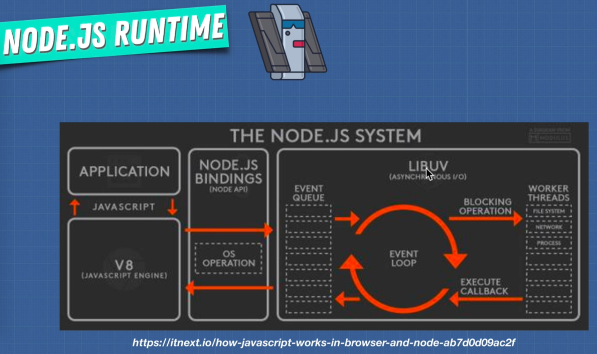

#### What is Node.js?
- Allows us to build scalable network applications using JavaScript on the server-side
- `V8 JavaScript Runtime`, that is the same runtime that is used in our `Chrome` browser
- Node does provides a wrapper around this engine providing additional functionality for building network applications
- It's fast because it's mostly `C++` code
- Use `V8` engine to understand JavaScript
- Use **`LIBUV`** library which works a lot to create a Event Loop to extend Async properties



#### What could we build?
- `Websocket server`, like a chat server
- Fast File Upload Client
- Ad Server
- Any Real-Time Data Apps

#### What is Node.js NOT?
- A Web Framework, not going to replace `Rails`, not `Django`,  
- For Beginners (It's very low level)
- Multi-threaded (think of it as a single threaded server)

#### Why JavaScript?
```
JavaScript has certain chaacteristics that make it very different that other dynamic languages, namely that it has no concept
of threads. Its model of concurrency is completely based around events.
                                                        --- Ryan Dahl
```

`Node.js is a non-blocking codes.`

#### Typical Blocking Things
- Calls out to web services
- Reads/Writes on the Databases
- Calls to extensions

#### Simple code

```
var http = require('http');         // how we require modules

http.createServer(function(request, response) {
    response.writeHead(200);           // status code in header
    response.write('Dog is running');  // Response body       
    response.end();                    // Close th connection
}).listen(8080);                       // Listen for connections on this port

console.log(Listening on port 8080);
```

#### Browser Sync
```
browser-sync start --server --directory --files "*"
```

#### Reinstall npm using nvm

    $ nvm install v<newversion> --reinstall-packages-from=<oldversion>
    # e.g. nvm install v7.1.0 --reinstall-packages-from=4.3.2

    $ nvm use 4.3.2            # Use a specific version

#### The 15 JavaScript concepts that every (NodeJS) programmer must know:

1. JavaScript (ES6) Class
2. JavaScript Prototype
3. Immediately Invoked Function Expression (IIFE)
4. JavaScript Closures
5. The Module Pattern
6. Hoisting
7. Understanding Scope
8. Currying
9. Memorization
10. Callback Function
11. The apply(), call(), bind() methods
12. Polymorphism in JavaScript
13. Asynchronous JS
14. Understand Promises
15. Async & Await

[See Reference](https://medium.com/@madasamy/15-javascript-concepts-that-every-nodejs-programmer-must-to-know-6894f5157cb7)