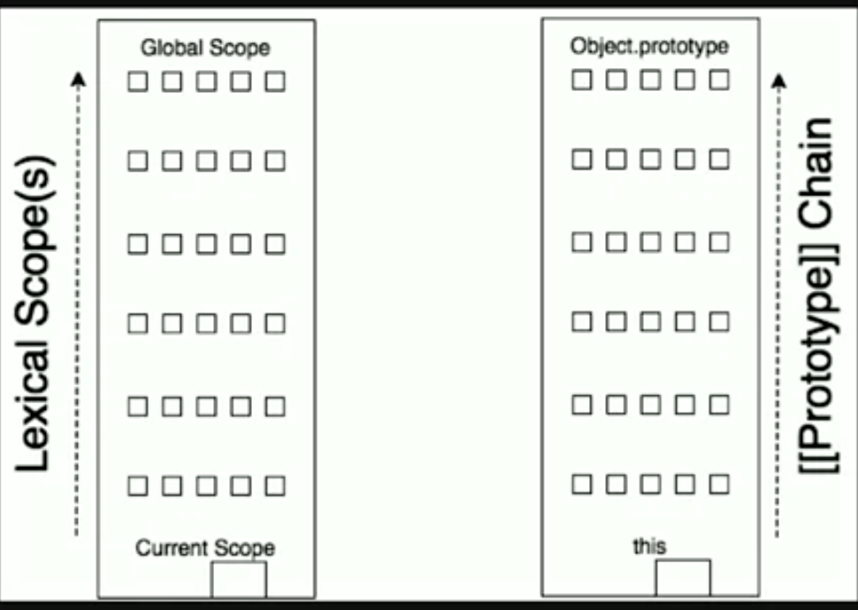

>JavaScript is a bit confusing for developers experienced in class-based languages (like Java or C++), as it is dynamic and does not provide a class implementation per se (the class keyword is introduced in ES2015, but is syntactical sugar, JavaScript remains prototype-based). [Ref.](https://developer.mozilla.org/en-US/docs/Web/JavaScript/Inheritance_and_the_prototype_chain)

## Prototypes!
- A constructor makes an object ~~"based on"~~ its own **prototype**. (JS doesn't do copy).
- A constructor makes an object `linked to` its own `prototype`.

#### What is a constructor call?
- Function call with a `new` keyword

#### What is **[[Prototype]]** and where does it come from?
- It means a object linkage. It comes when we create a `new object`.

#### How does **[[Prototype]]** affect the behavior of an object?
- When we call an method/property/object of an object, if it is not found then it is delegated the chaining by `[[Prototype]]`.

#### What is the 3 different ways to find where an object (say, `ob`) **[[Prototype]]** is linked to?
- `ob.__proto__`
- Object.getPrototypeOf(ob)
- ob.constructor.prototype

#### Discuss: `__proto__`, `[[prototype]]` and `prototype`
- `__proto__` brings direct access to [[Prototype]]. So, the `__proto__` setter allows the `[[Prototype]]` of an object to be mutated.
- `prototype` is the **object** that is used to build `__proto__` when we create an object with `new`.

- `[[Prototype]]` is an object specifies its prototype via the internal property.

```js
const foo = {
  getName: function() {
    return this.name;
  }
};

const a1 = {
  [[prototype]]: foo, // __proto__: foo
  name: 'sajib',
}

a1.getName(); // sajib
```

- `prototype` is not available on the instances themselves (or, other objects), but only on the **constructor functions**.
- `prototype` is only available on functions since they are **copied** from `Function` and `Object`, but in anything else it is not. However, `__proto__` is available everywhere.
- Any method declared directly to `Function` will be considered as `static method`, which means `it exists as local property of` that Function `only and won't available to its instances`.

```js
  function A() {
    function staticMethod() {
      // this is static method and can't access from the instance of A
    }
  }

  const ob = new A();
  ob.staticMethod(); 
  // TypeError: A.staticMethod is not a function
```

#### Two mechanism always exists in JavaScript codes -- Lexical Scopes & Prototype Chain:




#### Object Oriented in JavaScript

- Common OO patterns
- Prototype
- `Inheritance` vs `Behavior Delegation`

`Every single 'object' is built by a constructor function call`

## Explanation of Prototype

```js
function User(name) {
  this.name = name;
}

User.prototype.getName = function() {
  return this.name; 
}

const o1 = new User('a1');
const o2 = new User('a2');

o2.sayHello = function() {
  alert(`Hello, ${this.getName()}.`);
};

o1.constructor === User;
o2.constructor === o2.constructor;
o1.__proto__ === User.prototype;
o1.__proto__ === o2.__proto__;
```

#### When an inherited function is executed, the value of `this` points to the **inheriting** object, not to the `prototype object` where the function is an own property.

```js
var ob = {
  a: 2,
  f1: function() {
    return this.a;
  }
}

console.log(ob.f1()); // 2, this = ob

// o1 is an object that inherits/linked-to from 'ob'
const o1 = Object.create(ob);

o1.a = 5;
console.log(o1.f1()); // 5, this = o1 not ob!
```

#### New object using **Object.create()** (ES5)

```js
var a = {a: 1}; 
// a ---> Object.prototype ---> null

var b = Object.create(a);
// b ---> a ---> Object.prototype ---> null
console.log(b.a); // 1 (inherited)

var c = Object.create(b);
// c ---> b ---> a ---> Object.prototype ---> null

var d = Object.create(null);
// d ---> null
console.log(d.hasOwnProperty); 
// undefined, because d doesn't inherit from Object.prototype
```

#### New object using `Class` syntactical sugar:

```js
class Shape {
  constructor(h, w) {
    this.height = h;
    this.width = w;
  }
}

class Rectangle extends Shape {
  constructor(h, w) {
    super(h, w);
  }
  getArea() {
    return this.height * this.width;
  }
}

const o1 = new Rectangle(2, 3);
```

#### Similar in Object pattern

```js
function Shape(h, w) {
  this.height = h;
  this.width = w;
}

const Rectangle = Object.create(Shape.prototype);

Rectangle.getArea = function() {
  return this.height * this.width;
}

const o1 = Object.create(Rectangle)
console.log(o1);
```

#### Use `hasOwnProperty()` to know if the property exists as it's own property

```js
const ob = {};
ob.__proto__.a = 'Hello!';

console.log(obj); // {}
console.log(obj.a); // Hello!

console.log(ob.hasOwnProperty('a')); // false
console.log(ob.__proto__.hasOwnProperty('a.')); // true
```


__proto__ = null
|
|
__proto__ === Object.prototype
|
|
ob

#### Prototype `Shadowing`:

```js
function User(name) {
  this.name = name;
}

User.prototype.getName = function() {
  return this.name; 
}

const o1 = new User('a1');
o1.getName();  // a1

o1.getName = function() { // shadowing, in class system it is called 'method overriding in polymorphism
  // invoking User.prototype.getName but inside that method this = User.prototype
  // so, this.name = undefined

  // for o1
  console.log(`Hello, I'm ${this.__proto__.getName()}.`);
  // for o2, but for o1 it will go to Object.prototype & there is not 'name'
  console.log(`Hello, I'm ${this.__proto__.__proto__.getName()}.`); // for o2
}

o1.getName();
// if we create a new object from o1 (say, o2) then we need two __proto__ to invoke User.prototype.getName

o2 = Object.assign(o1, {a: 1});

// we can skip prototype chain & invoke User.prototype.getName directly
  console.log(`Hello, I'm ${User.prototype.identify.call(this)}.`);
```

#### Avoid Shadowing

```js
function User(name) {
  this.name = name;
}

User.prototype.getName = function() {
  return this.name; 
}

User.prototype.sayHello = function() {
  // this = o1, deligate to prototype chain & find getName() into User.prototype 
  return console.log(`Hello, ${this.getName()}.`);
}

const o1 = new User('a1');
```

#### Object Linked

```js
function Shape(height, width) {
  this.height = height;
  this.width = width;
}

Shape.prototype.getHeight = function() {
  return this.height;
}

Shape.prototype.getWidth = function() {
  return this.width;
}

function Rectangle(height, width) {
  Shape.call(this, height, width);
}

// Rectangle.prototype = new Shape(); // or,
Rectangle.prototype = Object.create(Shape.prototype);
// NOTE: .constructor is broken here, need to fix

Rectangle.prototype.getArea = function() {
  return this.getHeight() * this.getWidth(); 
}

const o1 = new Rectangle(2, 3);
const o1 = new Rectangle(4, 5);

o1.getArea(); // 6
o1.getArea(); // 20
```

#### OLOO (Object Linked to Other Object): delegated objects

```js
function Shape(height, width) {
  this.height = height;
  this.width = width;
}

Shape.prototype.getHeight = function() {
  return this.height;
}

Shape.prototype.getWidth = function() {
  return this.width;
}

function Rectangle(height, width) {
  Shape.call(this, height, width);
}

// Rectangle.prototype = new Foo(); // or,
Rectangle.prototype = Object.create(Shape.prototype);
// NOTE: .constructor is broken here, need to fix

Rectangle.prototype.getArea = function() {
  return this.getHeight() * this.getWidth(); 
}

const r1 = new Bar(2, 3);
r1.getArea(); // 6
```

## Convert the above codes to OLOO

```js
const Shape = {
  init: function(height, width) {
    this.height = height;
    this.width = width;
  },
  getHeight: function() {
    return this.height;
  },
  getWidth = function() {
    return this.width;
  },
}

const Rectangle = Object.create(Shape);
Rectangle.getArea = function() {
  return this.getHeight() * this.getWidth(); 
}

const r1 = Object.create(Bar);
r1.init(2, 3);
r1.getArea(); // 6

```

#### Class in ES6

- nicer syntax
- it's actually syntactical sugar, cause behind the scene prototype chain is working
- it has some limitations also

```js
class Shape {
  constructor(height, width) {
    this.height = height;
    this.width = width;
  }
  getHeight() {
    return this.height;
  }
  getWidth() {
    return this.width;
  }
}

const o1 = new Shape(2, 3);
const o2 = new Shape(4, 5);

o1.getHeight(); // 2
o1.getHeight(); // 4

class Rectangle extends Shape {
  getArea() {
    return this.getHeight() * this.getWidth();
  }
}

const r1 = new Rectangle(6, 7);
const r2 = new Rectangle(8, 9);

r1.getArea(); // ??
r2.getArea(); // ??

```


#### Different ways to create objects and the resulting prototype chain

```js
const o = {a: 1};
// o --> Object.prototype --> 
// o.__proto__ === Object.prototype // true
// o has no own property named 'hasOwnProperty' but the properties exists in Object.prototype so, o will inherits it


const b = [1, 2];
// b --> Array.prototype --> Object.prototype --> null
// b.__proto__ === Array.prototype // true
// indexOf, forEach, etc. will be inherited from Array.prototype


function f() {
  return 1;
}
// f --> Function.prototype --> Object.prototype --> null
// f.__proto__ == Function.prototype

```

#### Dig into some examples from [MDN](https://developer.mozilla.org)

```js
var shape = function () {};
var p = {
    a: function () {
        console.log('aaa');
    }
};
shape.prototype.__proto__ = p;

var circle = new shape();
circle.a(); // aaa
console.log(shape.prototype === circle.__proto__); // true

// or
var shape = function () {};
var p = {
    a: function () {
        console.log('a');
    }
};

var circle = new shape();
circle.__proto__ = p;
circle.a(); // a
console.log(shape.prototype === circle.__proto__); // false

// or
function test() {};
test.prototype.myname = function () {
    console.log('myname');
};

var a = new test();
console.log(a.__proto__ === test.prototype); // true
a.myname(); // myname


// or
var fn = function () {};
fn.prototype.myname = function () {
    console.log('myname');
};

var obj = {
    __proto__: fn.prototype
};

obj.myname(); // myname
```

[Reference](https://developer.mozilla.org/en-US/docs/Web/JavaScript/Reference/Global_Objects/Object/proto#Browser_compatibility)


#### Notes

- The `__proto__` property has been standardized in the ECMAScript 2015 language specification for web browsers to ensure compatibility, so will be supported into the future. It is deprecated in favor of `Object.getPrototypeOf/Reflect.getPrototypeOf` and `Object.setPrototypeOf/Reflect.setPrototypeOf` (though still, setting the `[[Prototype]]` of an object is a slow operation that should be avoided if performance is a concern)

- The `__proto__` property can also be used in an object literal definition to set the object `[[Prototype]]` on creation, as an alternative to `Object.create()`.

- The **prototype** object has a prototype of its own, and so on until an object with `null` as its prototype. By definition, `null` has no prototype, and acts as the final link of **prototype chain**.
- Nearly all objects in JS are instances of `Object` which sits on the top of a prototype chain.
- The `prototypal inheritance` model itself is, in fact, more powerful than the classic model. It is, for example, fairly trivial to build a classic model on top of a prototypal model.
- We can't extend an `Object`
  ```js
  var Ob = {};
  class User extends Ob { // <--- Error

  }
  ```
#### We have to call `super` first in constructor
  ```js
  class Foo {
    constructor(who) {
      this.me = who;
    }
    identify() {
      return this.me;
    }
  }

  class Bar extends Foo {
    constructor(who) {
      this.x = 1;  // <--- error!
      super(who);  // <-- this must come first
    }
  }

  const b1 = new Bar('b1');
  ```
