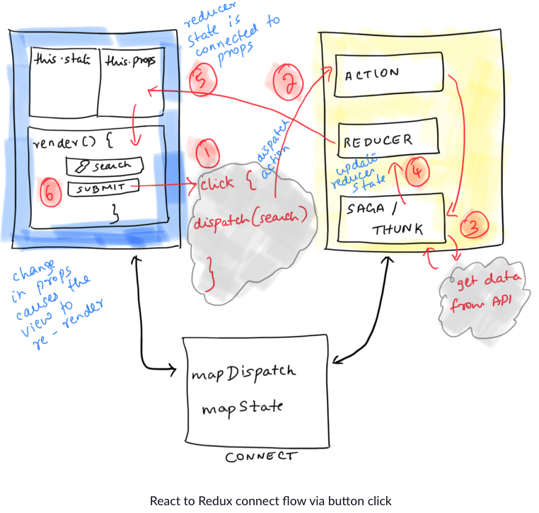

# Redux

#### What is Redux

Redux is a state management framework that can be used with a number of different web technologies, including React.

In Redux, there is a `single state object` that's responsible for the `entire` state of your application. This means if we had a React app with ten components, and each component had its own local state, the entire state of your app would be defined by a single state object housed in the Redux `store`.

`Store` is the single source of truth when it comes to application state.

```js
// reducer function takes state as an argument and returns `state`
const reducer = (state = 5) => {
  return state;
}

// create a redux store
const store = Redux.createStore(reducer);
```

#### React to Redux Connect Flow

1. Click the `submit` button on the React search component
2. The `click` function dispatches an Action. The Action `dispatch` function is connected to the search component via `mapDispatchToProps` and is made available to `this.props`

    

    [Reference](https://www.freecodecamp.org/news/how-to-connect-react-to-redux-a-diagrammatic-guide-d2687c14750a/)

3. (out of scope for this post) The dispatched action is responsible to `fetch` data and dispatch another action to update the Reducer state
4. The Reducer state updates itself with the new search data available from Step 3.
5. The Reducer state is already connected to `this.props` in the search component via `mapStateToProps`
6. `this.props` has the latest search data and the view now re-renders to show the updated search results

#### Get State from the Redux Store

Use `store.getState()` to retrieve the `state` from the `store`.

```js
const store = Redux.createStore((state = 5) => state);

// get state from the store
const currentState = store.getState();
```

## Redux Action

- An `action creator` is simply a JavaScript function that returns an action. In other words, action creators create objects that represent action events
- `dispatch` method is what you use to dispatch actions to the Redux store

#### Rules of Action Creator

1. Action creators `must` return action objects
2. Actions must have a type property
3. Actions can optionally have a `payload` 

```js
const store = Redux.createStore(
  (state = {login: false}) => state
);

// action creator
const loginAction = () => {
  return {
    type: 'LOGIN',
    payload: 'Sajib' // optional
  }
};

// dispatch the action
store.dispatch(loginAction())
```

#### Handle an Action in the Store

- `Reducers` in Redux are responsible for the `state modifications` that take place in response to `actions`
- A `reducer` takes `state` and `action` as `arguments`, and it always returns a **new state**
- The `reducer` function must always return a `new copy of state` and `never` modify state directly thought Redux does not enforce state immutability.

```js
const defaultState = {
  login: false
};

const reducer = (state = defaultState, action) => {
  // handle an action in the store
  return action.type === "LOGIN" ? { login: true } : state;
};

const store = Redux.createStore(reducer);

const loginAction = () => {
  return {
    type: 'LOGIN'
  }
};
```

#### Register a Store Listener

- We can access to on the Redux `store` object is **store.subscribe()**. This allows you to subscribe listener functions to the store.

```js
const ADD = 'ADD';

const reducer = (state = 0, action) => {
  switch(action.type) {
    case ADD:
      return state + 1;
    default:
      return state;
  }
};

const store = Redux.createStore(reducer);

// global count variable
let count = 0;

const callback = () => {
  count += 1;
}

// store listener: increment the global 'count' variable every time the store receives an action
store.subscribe(callback);

store.dispatch({type: ADD});
console.log(count); // 1
store.dispatch({type: ADD});
console.log(count); // 2
store.dispatch({type: ADD});
console.log(count); // 3
```

#### Combine Multiple Reducers

- First principle of Redux: all app state is held in a `single` state object in the store
- Redux provides reducer `composition` as a solution for a complex state model
- In order to let us combine `multiple` reducers together, Redux provides the `combineReducers()` method

```js
const INCREMENT = 'INCREMENT';
const DECREMENT = 'DECREMENT';

const counterReducer = (state = 0, action) => {
  switch(action.type) {
    case INCREMENT:
      return state + 1;
    case DECREMENT:
      return state - 1;
    default:
      return state;
  }
};

const LOGIN = 'LOGIN';
const LOGOUT = 'LOGOUT';

const authReducer = (state = {authenticated: false}, action) => {
  switch(action.type) {
    case LOGIN:
      return {
        authenticated: true
      }
    case LOGOUT:
      return {
        authenticated: false
      }
    default:
      return state;
  }
};

// combine multiple reducers
const rootReducer = Redux.combineReducers({
  count: counterReducer,
  auth: authReducer
})

// pass rootReducer into createStore
const store = Redux.createStore(rootReducer);
```

#### Use Middleware to Handle Asynchronous Actions

- Redux provides `middleware` designed specifically to handle `Asynchronous` called **Redux  Thunk Middleware**
- To include `Redux Thunk middleware`, we need to pass it as an argument to `Redux.applyMiddleware()`. This statement is then provided as a `second` optional parameter to the `createStore()` function.
- Create an `asynchronous` action that `return` a function in the action creator that takes `dispatch` as an `argument`. Within this function, we can `dispatch` actions and perform `asynchronous requests`.

```js
const REQUESTING_DATA = 'REQUESTING_DATA'
const RECEIVED_DATA = 'RECEIVED_DATA'

const requestingData = () => { return {type: REQUESTING_DATA} }
const receivedData = (data) => { return {type: RECEIVED_DATA, users: data.users} }

const handleAsync = () => {
  return function(dispatch) {
    // dispatch request action here
    dispatch(requestingData())
    setTimeout(function() {
      let data = {
        users: ['Jeff', 'William', 'Alice']
      }
      dispatch(receivedData(data))
      // dispatch received data action here

    }, 2500);
  }
};

const defaultState = {
  fetching: false,
  users: []
};

const asyncDataReducer = (state = defaultState, action) => {
  switch(action.type) {
    case REQUESTING_DATA:
      return {
        fetching: true,
        users: []
      }
    case RECEIVED_DATA:
      return {
        fetching: false,
        users: action.users
      }
    default:
      return state;
  }
};

const store = Redux.createStore(
  asyncDataReducer,
  Redux.applyMiddleware(ReduxThunk.default)
);
```

#### Write a Counter with Redux

```js
// define a constant for increment action types
const INCREMENT = 'INCREMENT';
// define a constant for decrement action types
const DECREMENT = 'DECREMENT'; 

const counterReducer = (state = 0, action) => {
  switch(action.type) {
    case INCREMENT:
      return state + 1;
    case DECREMENT:
      return state - 1;
    default:
      return state;
  }
}

const incAction = () => {
  return {
    type: INCREMENT
  }
}

const decAction = () => {
  return {
    type: DECREMENT
  }
}

const store = Redux.createStore(counterReducer)
```

## How React and Redux work with each other

```js
// Redux:
const ADD = 'ADD';

const addMessage = (message) => {
  return {
    type: ADD,
    message: message
  }
};

const messageReducer = (state = [], action) => {
  switch (action.type) {
    case ADD:
      return [
        ...state,
        action.message
      ];
    default:
      return state;
  }
};

const store = Redux.createStore(messageReducer);

// React:
const Provider = ReactRedux.Provider;
const connect = ReactRedux.connect;

// Change code below this line
class Presentational extends React.Component {
  constructor(props) {
    super(props);
    this.state = {
      input: ''
    }
 this.handleChange = this.handleChange.bind(this);
 this.submitMessage = this.submitMessage.bind(this);
  }
  handleChange(event) {
    this.setState({
      input: event.target.value
    });
  }
  submitMessage() {
    this.props.submitNewMessage(this.state.input);
    this.setState({
      input: ''
    });
  }
  render() {
    return (
      <div>
        <h2>Type in a new Message:</h2>
        <input
          value={this.state.input}
          onChange={this.handleChange}/><br/>
        <button onClick={this.submitMessage}>Submit</button>
        <ul>
          {this.props.messages.map( (message, idx) => {
              return (
                 <li key={idx}>{message}</li>
              )
            })
          }
        </ul>
      </div>
    );
  }
};
// Change code above this line

const mapStateToProps = (state) => {
  return {messages: state}
};

const mapDispatchToProps = (dispatch) => {
  return {
    submitNewMessage: (message) => {
      dispatch(addMessage(message))
    }
  }
};

const Container = connect(mapStateToProps, mapDispatchToProps)(Presentational);

class AppWrapper extends React.Component {
  render() {
    return (
      <Provider store={store}>
        <Container/>
      </Provider>
    );
  }
};
```