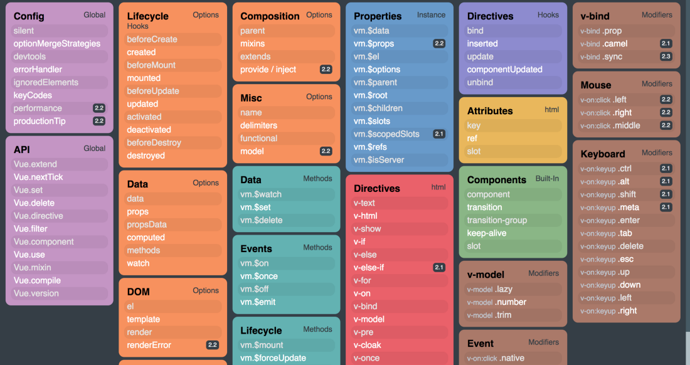
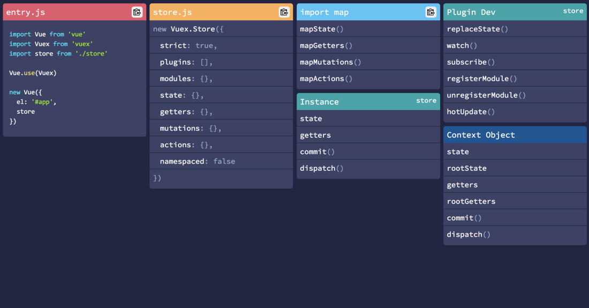
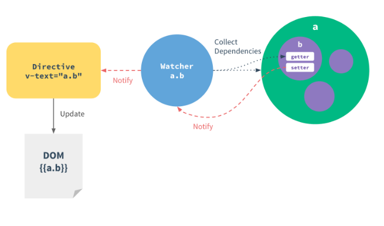

#### What is Vue.js?
A progressive, incrementally-adoptable JavaScript framework for building UI on the web.

#### Installing

```sh
$ yarn global add @vue/cli         # install cli
Or,
$ npm install -g @vue/cli          # install cli
$ vue -V                           # see cli version, e.g. 3.x

$ npm install -g vue               # install vue globally

# Create and run an app
$ vue create <project-name>      # create a project
$ npm run dev                    # run the app, url: localhost:8080

$ npm run build                  # compressed/minified files
```

#### Known Options for Vue instance

- **el:** Connect to DOM
- **data:** Store Data to be used
- **methods:** Methods of this Vue Instance
- **computed:** Dependent Properties
- **watch:** Execute code upon data changes

#### Key Sentences

- Components extends the Vue instance

#### For loop example

```html
<div class="column is-one-third" v-for="(faq, index) of faqs" :key='index'>
  <div class="card">
    <div class="card-content">
      <p class="title">{{ faq.title }}</p>
      <p class="answer">{{ faq.body }}</p>
    </div>
  </div>
</div>
```

```html
<!-- v-for and v-text directives -->

<li v-for="faq in faqs" v-text="name"></li>
```

#### Bind Attribute and Class Name

- We can't use interpolation syntax `{{ }}` inside any HTML attributes, so, we need to bind by using Vue's Directives like: v-bind:title="title". See below example: 

```html
<template>

  <style>
    .color-red { color: red; }
  </style>

  <button v-bind:title="title">Hover over me</button>
  <button :class="{ 'is-loading': isLoading }" @click="toggleClass">Click me</button>
  <button :disabled="isDisable" @click="toggleDisable">Disable me</button>
  <h1 :class="className">Hello World</h1>
</template>

<script>
  data: {
    className: 'color-red'
    title: "This title is being binded by JS"
  }
  data: {
    isLoading: false,
    isDisable: false
  }
  methods: {
    toggleClass() {
      this.isLoading = true;
    }
    toggleDisable() {
      this.isDisable = true;
    }
  }
</script>
```

#### Dynamic Components:

- We can use `<component>` to render dynamic components.

```html
<template>
  <div>
    <button @click="selectedComp = 'Comp1'">Component 1</button>
    <button @click="selectedComp = 'Comp2'">Component 2</button>
    <button @click="selectedComp = 'Comp3'">Component 3</button>

    <component :is="selectedComp">
      <p>Default Content</p>
    </component>
  </div>
</template>

<script>
import Comp1 from './Comp1.vue'
import Comp2 from './Comp2.vue'
import Comp3 from './Comp3.vue'

export default {
  data: {
    return {
      selectedComp: 'Comp1',
    }
  }
  components: {
    'comp1': Comp1,
    'comp2': Comp2,
    'comp3': Comp3,
  }
}
</script>
```

#### Prevent destroying components when rendering Dynamic components:

- we can use `<keep-alive>` to prevent destroying a component.
- Useful two lifecycle hooks: `Activated()` & `Deactivated()`.

```html
<template>
  <div>
    <button @click="selectedComp = 'Comp1'">Component 1</button>
    <button @click="selectedComp = 'Comp2'">Component 2</button>
    <button @click="selectedComp = 'Comp3'">Component 3</button>

    <keep-alive>
      <component :is="selectedComp">
        <p>Default Content</p>
      </component>
    </keep-alive>
  </div>
</template>

<script>
import Comp1 from './Comp1.vue'
import Comp2 from './Comp2.vue'
import Comp3 from './Comp3.vue'

export default {
  data: {
    return {
      selectedComp: 'Comp1',
    }
  }
  components: {
    'comp1': Comp1,
    'comp2': Comp2,
    'comp3': Comp3,
  }
}
</script>
```

#### Disable re-rendering with `v-once`

```html
<template>
  <div>
    <h1 v-once>{{ title }}</h1>
    <!-- <h1>Hello World</h1> -->

    <p>{{ sayHello() }} - <a v-bind:href="link">Google</a></p>
    <!-- Hello changed - <a href="http://google.com">Google</a></p>  -->

  </div>
</template>

<script>
  data: {
    title: 'Hello World!',
    link: 'http://google.com'
  },
  methods: {
    sayHello: function() {
      this.title = 'Hello changed',
      return this.title;
    }
  }
</script>

```

#### Output raw HTML with `v-html` directives.

Normally vue render the variable as text (it's safe for security). If we need to render as HTML then use `v-html`.

**N.B:** It can cause bad cors attack. Use this if the source is trusty/clean. 

```html
<template>
  <div>
    <p v-html="finishedLink"></p>
  </div>
</template>

<script>
  data: {
    finishedLink: '<a href="http://google.com">Google</a>'
  }
</script>

```

#### Get event data from the event

```html
<template>
  <div>
    <p v-on:mousemove="updateCoordinates">Coordinates: {{ x }} / {{ y }}</p>
  </div>
</template>

<script>
  data: {
    x: 0,
    y: 0
  }
  methods: {
    updateCoordinates(e) {
      this.x = e.clientX;
      this.y = e.clientY;
    }
  }
</script>

```

#### Pass own arguments with event object

```html
<template>
  <div>
    <button v-on:click="increase(2, $event)">Click me</button>
    <p>Counter: {{ counter }}</p>
  </div>
</template>

<script>
  data: {
    counter: 0
  }
  methods: {
    increase(step, e) {
      this.counter += step;
      e.preventDefault()
    }
  }
</script>
```

#### Modifying and event with event modifiers (e.g. `v-on:mousemove.stop=""`)

```html
<template>
  <div>
    <p v-on:mousemove="updateCoordinates">Coordinates: {{ x }} / {{ y }}
      <span v-on:mousemove.stop="">DEAD SPOT</span>
    </p>
  </div>
</template>

<script>
  data: {
    x: 0,
    y: 0
  }
  methods: {
    updateCoordinates(e) {
      this.x = e.clientX;
      this.y = e.clientY;
    }
  }
</script>
```

**Alternate:**

```html
<template>
  <div>
    <p v-on:mousemove="updateCoordinates">Coordinates: {{ x }} / {{ y }}
      <span v-on:mousemove="doStopPropagation">DEAD SPOT</span>
    </p>
  </div>
</template>

<script>
  data: {
    x: 0,
    y: 0
  }
  methods: {
    updateCoordinates(e) {
      this.x = e.clientX;
      this.y = e.clientY;
    },
    doStopPropagation(e) {
      e.stopPropagation();
    }
  }
</script>
```

#### Listening to keyboard events

```html
<template>
  <div>

    <input type="text" v-on:keyup.enter.space="alertMe">
    <!-- event will be triggered for any enter/space in input field -->

  </div>
</template>

<script>
  data: {
    x: 0,
    y: 0
  }
  methods: {
    alertMe() {
      alert('Alert!');
    }
  }
</script>
```

#### Writing JavaScript code in the Template

```html
<template>
  <div>
    <button v-on:click="counter++">Click me</button>
    <p>Counter: {{ counter > 10 ? 'Greater that 10' : 'Smaller or equal to 10' }}</p>
  </div>
</template>

<script>
  data: {
    counter: 0
  }
  methods: {
    increase(step, e) {
      this.counter += step;
      e.preventDefault()
    }
  }
</script>
```

#### Using Two way data binding `v-model="variable"`

```html
<template>
  <div>
    <input type="text" v-model="name">
    <p>{{ name }}</p>
  </div>
</template>

<script>
  data: {
    name: 'Jhon'
  }
</script>
```

#### Two way binding from Child to Parent

Vue.js has introduced a `.Sync` modifier to `v-bind` which update the Parent data from Child easily (from **>= 2.3.0**). Just emit the `update` event.

```html
<!-- parent -->
<child-component :inputData.sync="parentData"></child-component>

<!-- child -->
<input>type="text" v-model="inputData" @keyup="$emit('update:inputData', inputData);"</input>
```

#### Reacting to changing with Computed properties

```html
<template>
  <div id="app">
    <button v-on:click="counter++">Increase</button>
    <button v-on:click="counter--">Decrease</button>
    <button v-on:click="secondCounter++">Increase Second</button>

    <p>Counter: {{ counter }} | {{ secondCounter }}</p>
    <p>Counter: {{ result() }} | {{ output }}</p>
  </div>
</template>

<script>
  data: {
    counter: 0,
    secondCounter: 0
  },
  // caching the result, don't need to calculated always
  computed: {
    output: function() {
      console.log('Computed');
      return this.counter > 5 ? 'Greater than 5' : 'Smaller than 5'
    }
  },
  // always trigger cause  Vue does not know what is the codes in methods actually.
  methods: {
    result: function() {
      console.log('methods');
      return this.counter > 5 ? 'Greater 5' : 'Smaller than 5'
    }
  }
</script>
```

- An **Alternative** to computed properties `Watching` for

```js
// template same as before

<script>
  data: {
    counter: 0,
    secondCounter: 0
  },
  // caching the result, don't need to calculated always
  computed: {
    output: function() {
      console.log('Computed');
      return this.counter > 5 ? 'Greater than 5' : 'Smaller than 5'
    }
  },
  watch: {
    // counter matches with data 'counter', watching when the value of 'counter' changed, if change then this counter 
    // is triggered with the updated value.

    counter: function(value) => {
      var vm = this;
      setTimeout(function(){
        vm.counter = 0;
      }, 2000)
    }
  }
</script>
```

#### Dynamic styling with CSS classes

```html
<template>
  <div id="app">
  <div class="demo" @click="attachRed = !attachRed" :class="divClasses"></div>
  <div class="demo" @click="attachRed = !attachRed" :class="{ red:  attachRed }"></div>
  <div class="demo" :class="[color, { red: attachRed }]"></div>
</div>
<hr>

<input type="text" v-model="color">
</template>

<style>
  .red {
    background-color: red;
  }
  .green {
    background-color: green;
  }
</style>

<script>
el: '#app'
data: {
  attachRed: false,
  color:  'green'
},
computed: {
  divClasses() {
    return {
      red: this.attachRed,
      blue: !this.attachRed
    }
  }
}
</script>

```

#### Setting styles dynamically without CSS classes

```html
<template>
<div id="app">
  <div class="demo" :style="{ backgroundColor: color }"></div> <!-- Or, :style="{ background-color: color }" -->
  <div class="demo" :style="myStyle"></div>
</div>
<hr>
<input type="text" v-model="color">
<input type="text" v-model="width">
</template>

<script>
data: {
  color: 'gray';
  width: 100;
},
computed: {
  myStyle: function() {
    return {
      backgroundColor: this.color,
      width: this.width + 'px'
    }
  }
}
</script>
```

#### Styling elements with an Array syntax

```html
<template>
<div id="app">
  <div class="demo" :style="{ backgroundColor: color }"></div> <!-- Or, :style="{ background-color: color }" -->
  <div class="demo" :style="myStyle"></div>
  <div class="demo" :style="[ myStyle, { height: width + 'px' }]"></div>
</div>
<hr>
<input type="text" v-model="color">
<input type="text" v-model="width">
</template>

<script>
data: {
  color: 'gray';
  width: 100;
},
computed: {
  myStyle: function() {
    return {
      backgroundColor: this.color,
      width: this.width + 'px'
    }
  }
}
</script>
```

#### Conditioning rendering with v-if/v-else

```html
<template>
<div id="app">
  <p v-if="show">if statement <span> Nested element </span></p>
  <p v-else>else statement</p>

  <button @click="show = !show">Switch </button>
</div>
</template>

<script>
data: {
  show: false
}
</script>
```

#### Alternative of v-if using `<template>` (group html elements)

```html
<template>
<div id="app">
  <p v-if="show">if statement <span> Nested element </span></p>
  <p v-else>else statement</p>

  <template v-if="show">
    <h1>Heading</h1>
    <p>Inside a template </h1>
  </template>

  <button @click="show = !show">Switch </button>
</div>
</template>

<script>
data: {
  show: false
}
</script>

```

#### Use v-show if we don't want to detach element from DOM (v-show adds `style="display:none"`)

```html
<template>
<div id="app">
  <p v-show="show">if statement <span> Nested element </span></p>

  <button @click="show = !show">Switch </button>
</div>
</template>

<script>
data: {
  show: false
}
</script>
```

#### Rendering lists with `v-for`

```html
<div id="app">
  <ul>
    <li v-for="(ingredient, ind) in ingredients">{{ ingredient }} - {{ ind }}</li>
  </ul>
</div>

<script>
  data: {
    ingredients: ['meat', 'fruit', 'cookies'],
    positions: [
      {name: 'Max', age: '27', color: 'red'},
      {name: 'Anna', age: 'unknown', color: 'blue'}
    ]
  }
</script>
```

#### Use of `v-for` with `<template>`

```html
<div id="app">
  <ul>

    <!-- <template> </template> does not rendered in HTML only inner elements rendered -->
    <template v-for="(ingredient, index) in ingredients">
      <h1>{{ ingredient }}</h1>
      <h1>{{ index }}</h1>
    </template>

  </ul>
</div>

<script>
  data: {
    ingredients: ['meat', 'fruit', 'cookies'],
  }
</script>
```

#### Looping through objects

```html
<div id="app">
  <ul>
    <li v-for="person in persons">
      <div f-for="(value, key, index) in person">({{ index }}) {{key}}: {{ value }} </div> 
    </li>
  </ul>
</div>

<script>
  data: {
    positions: [
      {name: 'Max', age: '27', color: 'red'},
      {name: 'Anna', age: 'unknown', color: 'blue'}
    ]
  }
</script>
```

#### Looping through a lists of numbers

```html
<div id="app">
  <ul>
    <li v-for="person in persons">
      <div f-for="n in 10">{{ n }} </div> 
    </li>
  </ul>
</div>
```

#### Keeping track of Elements when using `v-for` (bind `:key=""`)

```html
<div id="app">
  <ul>
    <li v-for="person in persons">
      <div f-for="(value, key, index) in person" :key="ingredient">({{ index }}) {{key}}: {{ value }} </div>

      <button @click="ingredients.push('spices')">Add New Ingredient</button>
    </li>
  </ul>
</div>

<script>
  data: {
    ingredients: ['meat', 'fruit', 'cookies'],
  }
</script>
```

#### Access template from Vue module (`this.$refs`) by setting a ref

- If we change the by using `$refs` it changes in the DOM directly not in the Vue instance (template). So, if vue rerender the previous value will be reflected!

```html
<template>
  <button @click="changeInnerText" ref="myButton">Set Ref</button>
</template>

methods: {
  changeInnerText() {
    this.$refs.myButton.innerText = 'Text';
  }
}
```

#### Mounting a template

```html
<div id='app1'></div>

var vm1 = new Vue({
  template: '<h1>Hello VM1</h1>'
})

vm1.mount('app1');

// Alternate: 
vm1.mount();
document.getElementById('app1').appendChild(vm1.$el);

```

#### VueJS Instance Lifecycle

```html
<template>
  <button @click="title='Changed'">Update Title</button>
  <button @click="destroy">Destroy</button>
</template>

<script>
new Vue({
  el: '#app',
  data: {
    title: 'The VueJS Instance'
  },
  beforeCreate() {
    console.log('beforeCreate()');
  },
  created() {
    console.log('created()');
  },
  beforeMount() {
    console.log('beforeMount()');
  },
  mounted() {
    console.log('mounted()');
  },
  beforeUpdate() {
    console.log('beforeUpdate()');
  },
  updated() {
    console.log('updated()');
  },
  beforeDestroy() {
    console.log('beforeDestroy()');
  },
  destroyed() {
    console.log('destroyed()');
  },

  methods() {
    destroy() {
      this.$destroy();
    }
  }
})
</script>
```

#### Pass HTML content from parent to child using `<slot>`

```html
// parent.vue

<template>
<app-child>
  <h1 slot="headerH1">Pass this template from parent using Slot</h1>
  <p slot="paragraph">{{ name }}</p>
  <p>Default slot</p>


<!-- we can use interpolation also -->
</app-child>

</template>

<style>
import ./child.vue

data: () {
  return {
    name: 'Hello World'
  }
}
</style>
```

```html
// child.vue

<template>
  
  <div class="title">
    <slot name="headerH1"></slot>
  </div>

  <div class="paragraph">
    <slot name="headerH1"></slot>
  </div>

  <!-- if the slot has no name it is default slot -->
  <slot></slot>

</template>
<script>  

</script>
<style>
// the child's style will be applied when we use slot 
h1 {
  color: red;
}

</style>
```

#### How Directives work

Hooks workflow:

- `bind(el, binding, vnode)`: Once directive is Attached
- `inserted(el, binding, vnode)`: Inserted in Parent Node
- `update(el, binding, vnode, oldVnode)`: Once Component is Updated (without Children)
- `componentUpdated(el, binding, vnode, oldVnode)`: Once Component is Updated (with Children)
- `unbind(el, binding, vnode)`: Once directive is Removed

#### HTML5 History Mode

- The default mode for vue-router is hash mode - it uses the URL hash to simulate a full URL so that the page won't be reloaded when the URL changes.

- To get rid of the hash, we can use the router's `history mode`, which leverages the `history.pushState` API to achieve URL navigation without a page reload:

```js
const router = new VueRouter({
  mode: 'history',
  routes: [...]
})
```

**N.B.** Since our app is a single page client side app, without a proper server configuration, the user will get a 404 not found error. So, if no matched then, server should serve `index.html` always! 

#### Difference between `v-model` and `v-bind`

```html
<input v-model="something">
```

`v-model` is the syntactic sugar for:

```html
<input
  v-bind:value="something"
  :value="something" (shorthand syntax)
  v-on:input="something=$event.target.value"
  @input="something=$event.target.value" (shorthand)
>
```

[Ref:](https://stackoverflow.com/questions/42260233/vue-js-difference-between-v-model-and-v-bind)

#### Vuex

- MUTATIONS:
  - methods that changes the state with a minimum amount of logic.
  - must be synchronous
- ACTIONS:
  - set value in state (committing one or more mutations)
  - set and get value using a rest api
  - can be asynchronous
- GETTERS:
  - get values from state
  - transforming state values if required (similar as computed property of a Component)

#### Service worker caching config (Progressive Web App)

```js
  // service worker caching
  new SWPrecacheWebpackPlugin({
    cacheId: 'my-vue-app',
    filename: 'service-worker.js',
    staticFileGlobs: ['dist/**/*.{js,html,css}'],
    runtimeCaching: [
      {
        urlPattern: /^http:\/\/res\.cloudinary\.com\//,
        handler: 'cacheFirst'
      }
    ],
    minify: true,
    stripPrefix: 'dist/'
  });
```

#### Toggling similar elements

Vue elements will reuse elements that have the same tag name when using `v-if` on them.

```html
<template>
<div id="app">
  <div v-if="isUsername">
    <Label>Username</Label>
    <input />
  </div>
  <div v-else>
    <Label>Email</Label>
    <input />
  </div>

  <button @click="toggle"> Toggle </button>
</div>
</template>
```

```html
<script>
new Vue({
  el: "#app",
  data: {
    isUsername: true
  },
  methods: {
    toggle() {
      this.isUsername = !this.isUsername
    }
  }
})
</script>
```

Here, `<input />` element will not be replaced.

To solve this we just need to add a key to each of them so Vue knows they are distinct element:

```html
div id="app">
  <div v-if="isUsername" key="username"> <!-- key="username" -->
    <Label>Username</Label>
    <input />
  </div>
  <div v-else key="email"> <!-- key="email" -->
    <Label>Email</Label>
    <input />
  </div>
  
  <button @click="toggle"> Toggle </button>
</div>
```

#### Vue Router has 3 types of gurards

1. Global guards (on the instance)

   - These are called `each time the URL changes`
   - Guards: `beforeEach`, `beforeResolve`, `afterEach`

2. Route guards (on router definition)

   - These are `only called when the associated ROUTE is matched`
   - Guards: `beforeEnter`

3. Route Component guards

   - These are `only called when a ROUTE COMPONENT is used/unused`
   - Guards: `beforeRouterEnter`, `beforeRouterUpdate`, `beforeRouterLeave`

**NOTE:** All guards except `afterEach` are `asynchronous`. They are called in sequence, therefore, you need to explicitly call the `next()` methods to tell the router that we are done and that he can continue the sequence. This is also called `middleware pattern`.

- When to use each of them??

Assuming, we are navigating from `/` to `/contact`:

1. `beforeRouteLeave --` called on the `/` route component
2. `beforeEach --` called `globally` when a new navigation stars
3. `beforeEnter --` called when `/contact` route matches
4. `beforeRouteEnter --` called when `/contact` route component matches
5. `beforeResolve --` called `globally` when route component guards are done
6. `afterEach --` called `globally` when everything is resolved

## Filters

Filters are useable in two places -

  1. Mustache interpolations
  2. `v-bind` expressions

Filters should be appended to the end of the JavaScript expression, denoted by the `pipe` symbol.

```js
// in mustaches
{{ message | capitalize }}

// in v-bind
<div v-bind:itemId="itemId | formatId"></div>
```

#### Define Local Filter

Assign a filter method in Component's options -

```js
filters: {
  capitalize(value) {
    if (!value) return ''
    value = value.toString();
    return value.charAt(0).toUpperCase() + value.slice(1);
  }
}
```

#### Define a Global Filter

Assign a filter using `Vue.filter()` before initialize `Vue instance`:

```js
Vue.filter('capitalize', (value) {
  if(!value) return "";
  value = value.toString();
  return `${value.charAt(0).toUpperCase()}${value.slice(1)}`;
});

new Vue({
  ...
})
```

#### Chained Filter

Filter can be chained:

```js
{{ message | filterA | filterB }}
```

#### Mixin

- `{{ ... }}` is called `Interpolation` or `String Interpolation`

#### Vue Cheat Sheets



[Reference](https://medium.freecodecamp.org/modern-frontend-hacking-cheatsheets-df9c2566c72a)

#### Vuex Cheat Sheets



[Reference](https://medium.freecodecamp.org/modern-frontend-hacking-cheatsheets-df9c2566c72a)

#### **Shortcuts:**

```js
v-on:click="method"         -> @click="method"
v-bind:title                -> :title
```

**Ref:** https://github.com/sajibcse68/compare-vue

#### Initial Render

- Template
  - `(Compiled into)` Render Function --- (returns) New Virtual DOM
  - `(returns)` Virtual DOM --- (diffed against Old Virtual DOM) DOM Updates
  - `(generates)` Actual DOM --- Actual DOM

#### Virtual DOM

(Essentially) A lightweight JavaScript data format to represent what the actual DOM should look like at `a given point in time`.

- Actual DOM
  - document.createElement('div')
  - "[object HTMLDivElement]" --> Browser Native Object (expensive)
- Virtual DOM
  - vm.$createElement('div')
  - { tag: 'div', data: { attrs" {}, ... }, children: [] } --> Plain JavaScript Object (cheap)

Another benefits: Decouples rendering login from the actual DOM - enables rendering capabilities in non-browser environments, e.g. server-side and native mobile rendering.

#### Runtime + Compiler vs. Runtime-only

If we need to compile templates on the client(e.g. passing a string to the `template` option, or mounting to an element using its in-DOM HTML as the template), we need the `Compiler` to compile the template.

```js
// this requires the compiler
new Vue({
  template: '<div>{{ hi }}</div>
})

// this does not
new Vue({
  render(h) {
    return h('div', thisl.hi)
  }
})
```

- when using `vue-loader` or `vueify`, templates inside `*.vue` fiels are pre-compiled into JavaScript at build time.

- Since the runtime-only builds are roughly `30%` lighter-weight than their full-build counterparts, we should use it whenever we can.

Need this configure as alias:

```js
// webpack
moudule.exports = {
  // ...
  resolve: {
    alias: {
      'vue$': 'vue/dist/vue.esm.js' // 'vue/dist/vue.common.js' for webpack 1
    }
  }

}
```

```js
// babel.config.js
chainWebpack: config => {
  config.resolve.alias
    .set('vue$', 'vue/dist/vue')
},

```

[Ref](https://vuejs.org/v2/guide/installation.html#Runtime-Compiler-vs-Runtime-only)

#### Compile templates in client manually

Say, we need to generate the `Breadcrumb` manually using `<router-link>` (if we use anchor `<a>` element directlly then HTML5/Vue History mode does not work). So, we need to Compile it manually inside JS.

```html
<template>
  <component :is="breadcrumb"></component>
</template>
```

```js
import Vue from "vue";

export default {
  data() {
    return {
      breadcrumb: null
    }
  },
  computed: {
    ...mapGetters(['beadcrumb']) // coming from vuux
    /**
    * <div><li><router-link to="/dashboard"><i class="fa fa-server"></i><span>dashboard</span></router-link>
    * </li><li><router-link to="/dashboard/product"><span>product</span></router-link></li></div>
    **/
  },
  methods: {
    renderBreadcrumb() {
      this.breadcrumb = Vue.compile(this.breadcrumb); // compile manually & unpdate 'breadcrumb' data
    }
  },
  mounted() {
    this.renderBreadcrumb();
  },
  watch: {
    // it will trigger when 'breadcrumb' changes
    breadcrumb() {
      this.renderBreadcrumb();
    }
  }
}
```

#### Reactivity in Depth

- When we pass a plain JavaScript object to a Vue instance as its data option, Vue.js will walk through all of its properties and convert them to getter/setters using [Object.defineProperty](https://developer.mozilla.org/en-US/docs/Web/JavaScript/Reference/Global_Objects/Object/defineProperty)

- Due to the limitation of ES5, Vue.js **cannot detect property addition or deletion**

- Since Vue.js performs the getter/setter conversion process during instance initialization, a property `must be present in the data object` in order for Vue.js to convert it and make it `reactive`

  ```js
  var data = { a: 1 }
  var vm = new Vue({
    data: data
  })
  // `vm.a` and `data.a` are now reactive
  vm.b = 2
  // `vm.b` is NOT reactive
  data.b = 2
  // `data.b` is NOT reactive
  ```

- Add a property and make it `reactive` after an instance has been created

  ```js
  vm.$set('b', 2)
  // `vm.b` and `data.b` are now reactive

  Vue.set(data, 'c', 3)
  // `vm.c` and `data.c` are now reactive1
  ```

- New properties added to the object `will not trigger` changes so, create a `fresh object` with properties from both the original object and the mixin object

  ```js
  // instead of `Object.assign(this.someObject, { a: 1, b: 2 })`
  this.someObject = Object.assign({}, this.someObject, { a: 1, b: 2 })
  ```

Reactivity Workflow:

  

#### Reactivity inside Computed Properties

- Vue.js computed properties are **not** simple getters. Each computed property keeps track of its own reactive dependencies
- When a computed property is evaluated, Vue.js updates its `dependency list` and **caches** the result value. The cached value is only `invalidated` when one of the tracked dependencies have changed
- Because of computed property caching, the getter function is not always called when you access a computed property

  ```js
  var vm = new Vue({
    data: {
      msg: 'hi'
    },
    computed: {
      example: function () {
        return Date.now() + this.msg
      }
    }
  })
  ```

The computed property `example` has only one dependency: `vm.msg`. `Date.now()` is **not** a reactive dependency, because it has nothing to do with Vue’s data observation system. Therefore, when you programmatically access `vm.example`, you will find the timestamp to remain the same unless vm.msg triggers a `re-evaluation`.

In some use cases we may want to preserve the simple getter-like behavior, where every time we access `vm.example` it simply calls the `getter` again. We can do that by `turning off caching` for a specific computed property.

```js
computed: {
  example: {
    cache: false,
    get: function () {
      return Date.now() + this.msg
    }
  }
}
```

**N.B.** However, note this only affects programmatic access inside JavaScript; data-bindings are still dependency-driven. When we bind to a computed property in the template as `{{example}}`, the DOM will only be updated when a reactive dependency has changed.

#### Parent-Child Communication

We can use [ref](https://vuejs.org/v2/guide/components-edge-cases.html#Accessing-Child-Component-Instances-amp-Child-Elements) or [Even Bus](https://vuejs.org/v2/guide/state-management.html)

Need to Know:

1. `$on()` - allows to declare a listener on Vue instance with which to listen to events
2. `$emit()` - allows to trigger events on the same instance (self)


Using Refs:

```js
import ChildForm from './components/ChildForm'

new Vue({
  el: '#app',
  data: {
    item: {}
  },
  template: `
  <div>
     <ChildForm :item="item" ref="form" />
     <button type="submit" @click.prevent="submit">Post</button>
  </div>
  `,
  methods: {
    submit() {
      this.$refs.form.submit()
    }
  },
  components: { ChildForm },
})
```

Using Event Bus:

```js
import ChildForm from './components/ChildForm'

new Vue({
  el: '#app',
  data: {
    item: {},
    bus: new Vue(),
  },
  template: `
  <div>
     <ChildForm :item="item" :bus="bus" ref="form" />
     <button type="submit" @click.prevent="submit">Post</button>
  </div>
  `,
  methods: {
    submit() {
      this.bus.$emit('submit')
    }
  },
  components: { ChildForm },
})
```

// ChildForm.vue

```html
<template>
 ...
</template>

<script>
export default {
  name: 'NowForm',
  props: ['item', 'bus'],
  methods: {
    submit() {
        ...
    }
  },
  mounted() {
    this.bus.$on('submit', this.submit)
  },  
}
</script>
```

[Reference](https://stackoverflow.com/a/47565763/4133798)