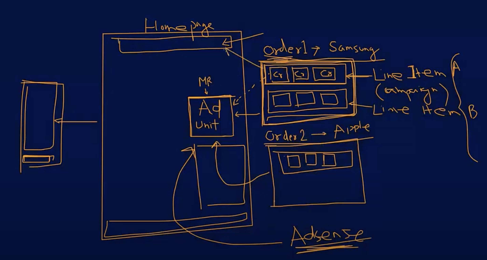
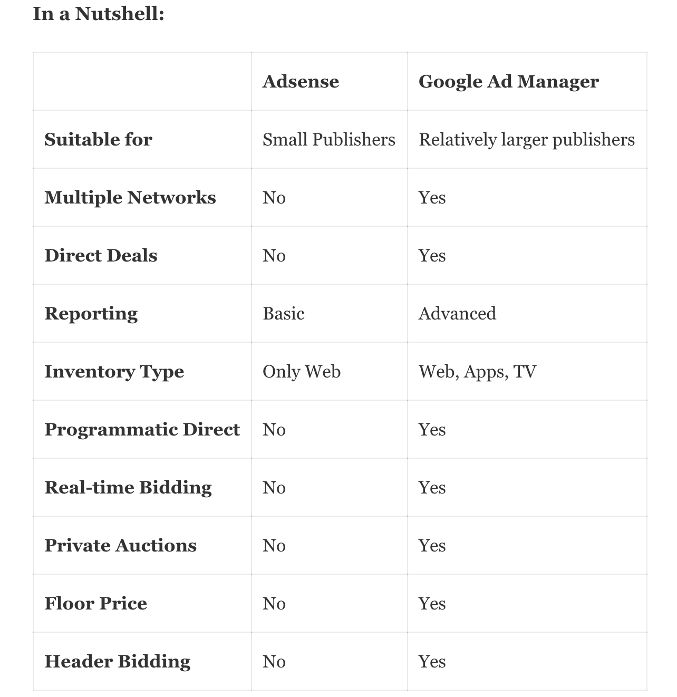

## What is Adsense?

`Adsense` is an ad network. It is a “plug and play” solution for small publishers where you just have to paste a code on your website and the ads start to deliver. There is **no minimum traffic requirement** for Adsense and therefore almost every publisher can access it with a website and a few articles.

In Adsense, the demand mostly comes from `Google Ads and other Google Certified Ad Networks(GCAN)`. Google Ads is an advertising platform mostly used by small and mid-sized businesses. These businesses have smaller budgets and very narrow, keyword-based contextual targeting, in short, their demand is minuscule when compared to global advertisers. This is why Adsense allows you to enroll in its program even when you’ve very little supply of inventory.

## What is Google Ad Manager?

To understand the Google Ad Manager, you’ve to see it through two different perspectives:

- As an Ad Server
- As a Supply Side Platform

### Google Ad Manager as an Ad Server

An [ad server](https://headerbidding.co/ad-server/) is a piece of technology that is responsible for managing and serving the ads to the user. The decision to serve the ads is done in real-time. As an Ad Server, Google Ad Manager helps publishers choose and deliver the appropriate ads based on various targeting criteria set for different campaigns.

But, delivering ads isn’t the only function of an ad server. As we said earlier, publishers can manage and control the campaigns with it. The publishers and advertisers want to know how the campaigns are performing, therefore,The ad server also provides insights into ad performance via its reporting features. Google Ad Manager performs these functions as well.

### Google Ad Manager as a Supply Side Platform

Supply-Side Platforms are the intermediary platforms that connect publishers to numerous demand partners at the same. Similar to an SSP, the functions of Google Ad Manager aren’t limited to serving ads and managing campaigns. It helps you with opening up your inventory to multiple ad networks and ad exchanges. Ad Manager can add more ad networks like Adsense. 

It helps you create competition among your demand sources to increase your revenue. The competition is created by conducting auctions among the demand partners. A demand partner will be ready to pay for an impression when the impression has the chances of conversion (sale, signup, lead generation, etc).But since the demand partner is buying the impression from the auction, its bid has to be higher than the fellow bidders. The same principle applies to the other bidders in the auction, hence everyone is motivated to to pay higher, resulting in better revenue for the publisher.

Google Ad Manager also provides you solutions like Dynamic Allocation, First Look, Optimised Competition to improve your yield. 

## Adsense vs Google Ad Manager

they both deliver ads, they are both connected to demand sources, they can be used together and they can also be used without each other. Why is that the case? In this blog, we’ll try to understand the difference between the two.

Based on the basic functionalities, the differences between Adsense and Google Ad Manager are evident:

`Suitability`: Adsense is suitable for small publishers that have just started, and don’t need much control or insights on the ad delivery process because the traffic is just a few thousand pageviews (100K-500K). Whereas, publishers that need to control and manage multiple campaigns on their sites, need to use Ad Manager.

`Multiple Networks`: Publishers who are only using Adsense on their sites can work without Ad Manager. They can simply integrate Adsense by adding its code to the site and they are good to go. Whereas publishers will have to use GAM if they want to bring more demand than just AdSense. Adsense can be one of the multiple ad networks integrated with the site.

`Direct Deals`: Adsense is good for publishers who haven’t started receiving direct deals to run on their sites. Whereas publishers who are being approached by the advertisers to run direct campaigns need Ad Manager.

`Reporting`: Publishers who presently do not need advanced reporting on their inventory can keep using Adsense for the time being. The publishers in this category are at their initial stage when they are not working with any direct demand partners and not generating any significant revenue. Whereas publishers who want granular reporting on the performance of the ads should use Google Ad Manager. The publishers in this category need granular reporting because a miniscule improvement in the performance can bring considerable increase in income.

`Inventory Type`: Adsense supports only basic web ads. So the publishers who are showing ads only on the web can fulfill their needs through Adsense. Whereas publishers who have their inventory on web, apps, TV, etc need to use Ad Manager.

## Google Ad Manager with AdX account

When you have an AdX account then the capabilities of GAM increase further:

`Programmatic Direct Deals`: You can use GAM to send and receive proposals for direct deals programmatically. You can check, approve, or reject the proposals coming from advertisers at a single place. There are no such arrangements in Google Adsense.

`Real-time Bidding`: Most of the demand from Adsense is based on pre-set criteria by the advertisers, through Google Ads. Whereas GAM can help you connect with demand sources that use real-time bidding.

Real-time bids come from trading desks that are more advanced than Google Ads. The bids are based on real-time data of the users, hence the ads are more relevant with higher conversion rates. The advertisers using the trading desks are also large-scale buyers. Due to the bigger demand and targeted ads the revenue is higher when advertisers are bidding for your inventory in real-time.

`Private Auctions`: After signing the direct deals with the advertisers, you can hold private auctions among them to sell your premium inventory at premium rates. Since Adsense doesn’t conduct real-time bidding, private auctions aren’t possible with it.

`Floor Price`: Google Ad Manager allows you to set a minimum price of your inventory. By setting a floor price, you can improve your revenue and maintain the quality of ads on your site. When the floor price is set, you restrict the advertisers to stop buying the ad inventories at lower costs. By doing so, you also stop the low-quality ads that are generally targeted at sub-par inventory. Whereas with Adsense, you’ve to accept whatever rates you are getting.

## Top Performing Ad Sizes

### 728x90 - leaderboard

Tends to have more ad inventory available from advertisers, which can increase earnings when both text and image ads are enabled.

Performs well if placed above main content, and on forum sites.

Can also be used with tablet-optimized pages.

### 336x280 - Large Rectangle

Tends to have more ad inventory available from advertisers, which can increase earnings when both text and image ads are enabled.

Performs well when embedded within text content or at the end of articles.

### 300x250 - Medium Rectangle

Tends to have more ad inventory available from advertisers, which can increase earnings when both text and image ads are enabled.

Performs well when embedded within text content or at the end of articles.

### 300x50 - Mobile Banner

Mobile-friendly web size also known as "smartphone banner." It fits larger smartphone screens at the top or bottom of the screen.

### 160x600 - Wide Skyscraper

Tends to have more ad inventory available from advertisers, which can increase earnings when both text and image ads are enabled.

Best if used along sidebars of webpages.
