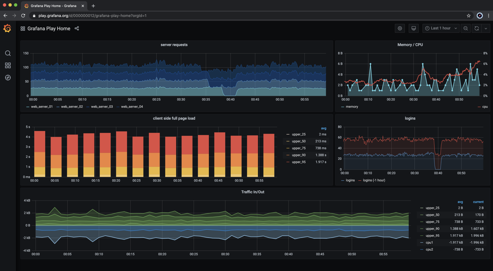

### What is Grafana and how does it work?

Grafana is a web application that allows us to visualize data sources. A visualization can be a graph or chart. It comes with a `variety of chart types`, allowing us to choose whatever fits our monitoring data needs. Multiple charts are grouped into dashboards in Grafana, so that multiple metrics can be viewed at once.

The metrics displayed in the Grafana charts come from data sources. **Prometheus is one of the supported data sources for Grafana**, but it can also use other systems, like `AWS CloudWatch`, or `Azure Monitor`.

Grafana also allows you to define alerts that will be triggered if certain issues arise, meaning you’ll receive an email notification if something goes wrong.

### Prometheus with Grafana

Prometheus is a powerful open-source tool for self-hosted monitoring. It’s a good option for cases in which you don’t want to build from scratch but also don’t want to invest in a SaaS solution.

With a community-supported client library for Node.js and numerous client libraries for other languages, the monitoring of all your systems can be bundled into one place.

Its integration is straightforward, involving just a few lines of code. It can be done directly for long-running services or with help of a push server for short-lived jobs and FaaS-based implementations.

Grafana is also an open-source tool that integrates well with Prometheus. Among the many benefits it offers are flexible configuration, dashboards that allow you to visualize any relevant metric, and alerts to notify of any anomalous behavior.

These two tools combined offer a straightforward way to get insights into your systems. Prometheus offers huge flexibility in terms of metrics gathered and Grafana offers many different graphs to display these metrics. Prometheus and Grafana also integrate so well with each other that it’s surprising they’re not part of one product.

You should now have a good understanding of Prometheus and Grafana and how to make use of them to monitor your Node.js projects in order to gain more insights and confidence of your software deployments.
