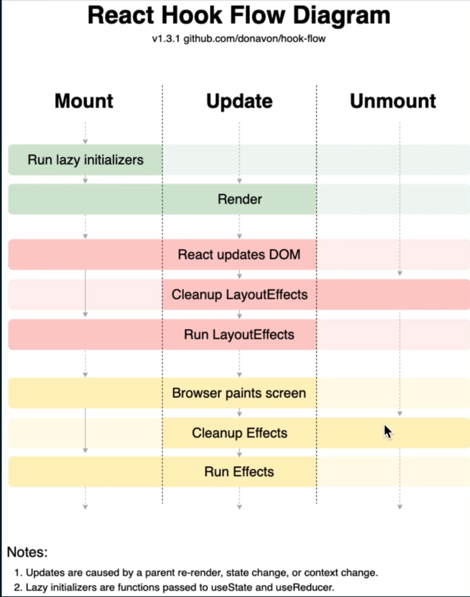

#### What is React?

A JavaScript library for building user interfaces. React makes it painless to create interactive UIs. Design simple views for each state in your application, and React will efficiently update and render just the right components when your data changes

#### Installing

```sh
$ npm install -g create-react-app

$ create-react-app <app-name>  # create a new app

# Run an app
$ npm start     # run the app, default localhost:3000
```

**Ref:** https://github.com/sajibcse68/compare-react

## React Props

#### Use `Default Props`

Default props allows us to specify what a prop value should be if no value is explicitly provided.

```js
MyComponent.defaultProps = {
  location: 'San Francisco',
};
```

React assigns default props if props are `undefined`, but if we pass `null` as the value for a prop, if will remain `null`.

#### Use `PropTypes` to Define the Props We Expect

It's considered a best practice to set `propTypes` when we know the type of a prop ahead of time. We can define a `propTypes` property for a component in the same way we defined `defaultProps`.

```js
MyComponent.propTypes = {
  handleClick: PropTypes.func.isRequired,
};
```

Here, `PropTypes.func` part checks that `handleClick` is a function. Adding `isRequired` tells React that `handleClick` is s required property for that component.

Among the `seven` JavaScript Primitive types, `function` and `boolean` (written as `bool`) are the only two hat use unusual spelling.

Note: React `v15.5.0`, `PropTypes` is imported independently from React, like this:

```js
import React, { PropTypes } from 'react';
```

## Life Cycle

### React Hook Flow Diagram
.


### React App Life-cycle Walk through

1. JS file loaded by the browser
2. Instance of App component is created
3. App components `constructor` function gets called
4. State object is created and assigned to the `this.state` object
5. Call any local method of component
6. React calls the components render method
7. App returns `JSX`, gets rendered to page as HTML

### LifeCycle Methods in Class Component

```js
// Mounting Life Cycles
constructor() {
  // before component is mounted
}
getDerivedStateFromProps() {
  // invoked right after component is constructed
}
render() {
  // when first mounted
}
componentDidMount() {
  // right after component is mounted
}

// Updating Life Cycles
getDerivedStateFromProps() {
  // invoked right after component is receives new props
}
shouldComponentUpdate() {
  // if this returns false, then render() and componentDidUpdate() won't be called
}
render() {
  // when data changes
}
getSnapshotBefore() {
  // right before most recently rendered output is rendered
}
componentDidUpdate() {
  // invoked right after update
}

// Unmounting Life Cycle
componentWillUnmount() {
  // invoked right before a component is unmounted
}
```

## React State

### Understanding React `setState`

`setState()` is the only legitimate way to update state after the initial state setup.

Key Notes:

- Update to a component state should be done using `setState()`
- We can pass **object** or **function** to `setState()`
- We have to pass `function` when we need to update state multiple times
- Do not depend on `this.state` immediately after calling `setState()` since it is Asynchronous. Use `Callback`.

#### Update a State Property

we can pass an object as arguments of `setState()`.

```js
import React, { Component } from 'react';

class Search extends Component {
  constructor(props) {
    super(props);

    state = {
      searchTerm: '',
    };
  }

  updateState = (event) => {
    // update searchTerm, say this function is called from UI
    setState({
      searchTerm: event.target.value,
    });
  };
}
```

#### Passing a Function to `setState()`

What if we want to increment a counter 3 times after clicking a button one time? Let's see:

```js
handleIncrement() {
  this.setState({ count: this.state.count + 1 });
  this.setState({ count: this.state.count + 1 });
  this.setState({ count: this.state.count + 1 });
}
```

we might be surprised to find **that doesn't work**. It's `equivalent` to:

```js
Object.assign(
  {},
  { count: this.state.count + 1 },
  { count: this.state.count + 1 },
  { count: this.state.count + 1 }
);
```

So, instead of call happening three times, it happens just once.
This can be fixed by `passing a function` to **setState()**.

```js
handleIncrement() {
  this.setState((prevState) => ({ count: prevState.count + 1 }));
  this.setState((prevState) => ({ count: prevState.count + 1 }));
  this.setState((prevState) => ({ count: prevState.count + 1 }));

  // now incrementing count three times with one click!
}
```

#### Access Previous State using Updater

when we pass `function` to `setState()`, first argument is the prevState.

```js
this.setState((prevState) => {
  // prevState is the current state
  return { count: prevState + 1 };
});
```

### What is useState Lazy Initialization?

The arguments passed to `useState` is the `initialState`, the value which initialize your state in the **first** render and gets disregarded in subsequent renders. For example:

```js

const component = () => {
  const [state, setState] = useState(getInitialThousandsItems());
}
```

`Even though the initial value is disregarded upon next renders, the function which initializes it still gets called!`

Lets assume **getInitialThousandsItems()** takes significant time so, in this case you can pass a `function` which returns initial
state, this function will ony be executed once (initial render) and not on each render like the above code will. This is called the `lazy initialization of useState`.

```js

const component = () => {
  const [state, setState] = useState(getInitialThousandsItems);
}

// getInitialThousandsItems() -> getInitialThousandsItems
```

### When to Use Derived State?

`getDerivedStateFromProps` exists for only one purpose. It enables a component to update its internal state as the result of **changes in props**.

Derived state should be used sparingly. All problems with derived state that we have seen can be ultimately reduced to either

(1) unconditionally updating state from props or
(2) updating state whenever props and state don’t match. (We’ll go over both in more detail below.)

- If we’re using derived state to memoize some computation based only on the current props, you don’t need derived state. See [What about memoization](https://reactjs.org/blog/2018/06/07/you-probably-dont-need-derived-state.html#what-about-memoization)?
- If we’re updating derived state unconditionally or updating it whenever props and state don’t match, your component likely `resets its state too frequently`.

```js
static getDerivedStateFromProps(props, state)
```

### What is `flusSync`?

**flushSync** lets you force React to flush any updates inside the provided callback synchronously. This ensures that the DOM is updated immediately.

```js
import { flushSync } from 'react-dom';

flushSync(() => {
  setSomething(123);
});

```

React will immediately call this callback and flush any updates it contains synchronously. It may also flush any pending updates, or Effects, or updates inside of Effects. If an update suspends as a result of this flushSync call, the fallbacks may be re-shown.

### Alternative State Initialization

we can initialize `state` directly in Class instead of inside constructor. [Babel](https://babeljs.io/repl) product the same output after processing.

```js
class App extends React.Component {
  constructor(props) {
    super(props);
    this.state = { loading: true };
  }
}

// equivalent of

class App extends React.Component {
  state = { loading: true };
}
```


## React Hooks

### Which is preferred, `useLayoutEffect` or `useEffect`?

####  useLayoutEffect vs useEffect

| useLayoutEffect                                      |  useEffect                                  |
| ----------------------------------                   | -------------                               |
| works Synchronously                                  | works Asynchronously                        |
| runs Before the browser repaints the screen          | runs After the browser repaints the screen  |
| Blocking, blocks the UI updates (visual changes)     | Non-blocking, does not block UI updates     |
| use when need control before painting the UI updates | use in API call, side effects, etc.         |

#### What would happen if a user clicks on a 'count button' on the UI?

1. The user clicks the count button
2. React updates the `count state` variable internally
3. React handles the DOM mutation
4. The `useLayoutEffect` hook is fired
5. The browser waits for `useLayoutEffect` to finish and then paints the DOM changes to the browser screen
6. The `useEffect` function is fired after the browser has painted the DOM changes


```js
  useEffect(() => {
    console.log("log 1")
  }, [])
  useLayoutEffect(() => {
    console.log("log 2")
  }, [])

/** 
 * // output
 * log 2
 * log 1
*/

```

#### When to use `useLayoutEffect` instead of `useEffect`?

- if you need to modify or, measure the DOM layout
- animations, transitions, get the scroll position, etc.
- component flickers when the state is updated, which means it first renders in a partially-ready state before re-rendering its final state right away
- need synchronous control before painting the DOM changes on UI

[Ref:](https://kentcdodds.com/blog/useeffect-vs-uselayouteffect)

### What is `useImperativeHandle` hook?

The `useImperativeHandle` hook in React is a way to **customize the instance value that is exposed to parent components when using refs**. It allows you to have more control over what parts of a child component the parent can access and interact with.

### Why use useImperativeHandle?

- **Encapsulation:** It helps you hide the internal implementation details of a child component and expose only a specific API to the parent.
- **Controlled Interaction:** You can define exactly which methods or properties the parent can access, preventing accidental or unintended modifications.
- **Refactoring:** It makes it easier to refactor the child component's internal workings without affecting the parent component, as long as the exposed API remains the same.

#### How useImperativeHandle works??

1. ref: You create a ref in the parent component using useRef.

2. useImperativeHandle in the child: In the child component, you use useImperativeHandle with the following arguments:
    - **ref:** The ref created in the parent.
    - **createHandle:** A function that returns an object. This object defines the API that will be exposed to the parent.
    - **dependencies (optional):** An array of dependencies. If any of the dependencies change, the createHandle function will be re-executed.

#### How can we focus a child component's input element using `useImperativeHandle`?

```js
// ParentComponent.js
import React, { useRef } from 'react';
import ChildComponent from './ChildComponent';

function ParentComponent() {
  const childInputRef = useRef(null);

  const handleClick = () => {
    if (childInputRef.current) {
      childInputRef.current.focusInput(); // Call the exposed method
    }
  };

  return (
    <div>
      <ChildComponent ref={childInputRef} />

      <button onClick={handleClick}>Focus Child Component's Input</button>
    </div>
  );
}

// ChildComponent.js
import React, { forwardRef, useImperativeHandle } from 'react';

const ChildComponent = forwardRef((props, ref) => {
  const inputRef = useRef(null);

  useImperativeHandle(ref, () => ({
    focusInput: () => {
      if (inputRef.current) {
        inputRef.current.focus();
      }
    },
  }));

  return <input type="text" ref={inputRef} />;
});
```

In this example, the parent component can call the `focusInput` method on the child component's ref, which is exposed through `useImperativeHandle`.

#### When to use `useImperativeHandle`?

- **Focus Management:** Controlling focus on input fields or other elements within a child component.
- **Complex UI Components:** Exposing specific methods for controlling the behavior of a complex UI component (e.g., a custom modal or dropdown).
- **Third-Party Libraries:** Integrating with third-party libraries that require imperative access to DOM elements or component methods.

## Type of Components

### Stateless Functional Component, Stateless Component and Stateful component

- `A stateless functional component` is any function we write which accepts `props` and return `JSX`

- `A stateless component` is a class that extends `React.Component`, but does not use internal state.

- `A state`ful component`is any component that does maintain its own internal state. We may see stateful component referred to simply as`components`or`React components`.

[Reference](https://css-tricks.com/understanding-react-setstate/)


### Compound Components

```js
const Display = ({ ifTruthy = true, children } => {
  (ifTruthy)
  ? React.Children.only(children)
  : null
})

const age = 20;

React.DOM.render(
  <Display ifTruthy={age >= 18}>
    <h1>You can vote!</h1>
  </Display>,
  document.getElementById('root');
)
```

### Uncontrolled Components

```js
const EncouragementForm extends React.Component {
  handleSubmit = e => {
    alert(this.input.value);
    e.preventDefault();
  }
  render() {
    <form onSubmit={this.handleSubmit}>
      <label>
        Send an Encouraging message:
        <input type="text" ref={input => this.input = input }/>
      </label>
      <button> Submit </button>
    </form>
  }
}
```

### Controlled Components

```js
const EncouragementForm extends React.Component {
  state = {
    message: ''
  }
  handleChange = e => {
    this.setState({
      message: e.target.value
    })
  }
  handleSubmit = e => {
    alert(this.state.message);
    e.preventDefault();
  }
  render() {
    <form onSubmit={this.handleSubmit}>
      <label>
        Send an Encouraging message:
        <input type="text" value={this.state.message} onChange={this.handleChange}/>
      </label>
      <button> Submit </button>
    </form>
  }
}
```

### Higher Order Components

When a components take a component as parameter and return a new component is called `Higer Order Component`.

```js
// higher order components
const DataComponent = (ComposedComponent, url) =>
  class DataComponent extends React.Component {
    constructor(props) {
      super(props);
      this.state = {
        data: [],
        loading: false,
        loaded: false
      }
    }
    componentDidMount() {
      this.setState({loading: true})
      fetch(url)
        .then(resp => resp.json())
        .then(data =>
          this.setState({
            loaded: true,
            loading: false,
            data
          });
        )
    }
    render() {
      return (
        <div>
          { this.state.loaded
            ? <ComposedComponent { ...this.state } {...this.props} />
            : <div>Loading</div>
          }
        </div>
      )
    }
  }

const PeopleList = ({data}) =>
  <ol>
    {data.results.map((person, i) => {
      const { first, last } = person.name;
      return (
        <li key={i}>{first} {last}</li>
      )
    })}
  </ol>

const RandomMeUsers = DataComponent(
  PeopleList,
  "https://randomuser.me/api?results=10"
  )

ReactDom.render(
  <RandomMeUsers />,
  document.getElementById('root')
)
```

## React Fragment

we can use `React.Fragment` instead of using any extra `div` or `section`, etc.

```js
const NavItems = () => (
  <React.Fragment>
    <a href="/">Home</a>
    <a href="/about">About</a>
    <a href="/services">Services</a>
    <a href="/contact">Contact</a>
  </React.Fragment>
);
```

const App = () => {

  <header>
    <nav>
      <NavItems />
    </nav>
  </header>

ReactDOM.render(
<App />,
document.getElementById('root');
)
}

**N.B.** Shortcut of `<React.Fragment></React.Fragment>` is `<></>`

## Refs and the DOM

Refs provide a way to access DOM nodes or React elements created in the render method.

#### When to Use Refs

- Managing focus, text selection, content length or, media playback
- Triggering imperative animations
- Integrating with third-party DOM libraries

Avoid using refs for anything that can be done declaratively, e.g. instead of exposing `oepn()` and `close()` methods on a `Dialog` component, pass an `isOpen` prop to it.

### Creating Refs

Refs are created using `React.createRef()` and attached to React elements via the `ref` attribute. Refs are commonly assigned to an instance property when a component is constructed so they can be referenced throughout the component.

```js
class MyComponent extends React.Component {
  constructor(props) {
    super(props);
    this.myRef = React.createRef();
  }
  render() {
    return <div ref={this.myRef} />;
  }
}
```

### Accessing Refs

When a ref is passed to an element in `render`, a reference to the node becomes accessible at the `current` attribute of the ref.

```js
const node = this.myRef.current;
```

The value of the ref depending on the type of the node:

- When the `ref` attribute is used on an HTML element, the `ref` created in the constructor with `React.createRef()` receives the underlying DOM elements as its `current` property.

- When the ref attribute is used on a custom class component, the ref object receives the mounted instance of the component as its current.

- **You may not use the ref attribute on function components** because they don’t have instances.

### Use Callback on Image Load with Ref

```js
class MyComponent extends React.Component {
  constructor(props) {
    super(props);
    this.imageRef = React.createRef();
  }
  componentDidMount() {
    this.imageRef.current.addEventListener('load');
  }
  render() {
    const { description, url } = this.props.image;
    return (
      <div>
        
      </div>
    )
  }
}
```
## React Portals

Portals provide a first-class way to render children into a DOM node that exists outside the DOM hierarchy of the parent component.

```js
ReactDOM.createPortal(child, chontainer);

// the first argument `child` is any renderable React child, such as an element, string or fragment. The second argument `container` is a DOM element
```

#### Usage of Portals

Normally, when we return an element from a component’s render method, it’s mounted into the DOM as a child of the nearest parent node:

```js
render() {
  // React mounts a new div and renders the children into it
  return (
    <div>
      {this.props.children}
    </div>
  );
}
```

However, sometimes it’s useful to insert a child into a different location in the DOM:

```js
render() {
  // React does *not* create a new div. It renders the children into `domNode`.
  // `domNode` is any valid DOM node, regardless of its location in the DOM.
  return ReactDOM.createPortal(
    this.props.children,
    domNode
  );
}
```

A typical use case for portals is when a parent component has an **overflow: hidden** or **z-index** style, but you need the child to visually “break out” of its container. For example, `modal dialogs`, `hovercards`, and `tooltips`.

**Note:** When working with portals, remember that managing keyboard focus becomes very important.

[Ref](https://reactjs.org/docs/portals.html)

## React Route

#### Familiar with Various React Router Libraries

1. `react-router`: Core navigation lib - we don't install this manually
2. `raect-router-dom`: Navigation for dom-based apps
3. `react-router-native`: Navigation for react-native apps
4. `react-router-redux`: Bindings between Redux and React Router

#### How to Not Navigation with React Router

Bad Navigation:

1. We add `<a/>` tag to our application with `href="/pagetwo"` and click it
2. Our browser makesa request to localhost:3000
3. Development server responds with `index.html` file
4. Browser receives `index.html` file, dumps old HTML file it was showing (including all of our React/Redux state data!)
5. `index.html` file lists our JS files in script tags - browser downloads and executes these scripts
6. Our app starts up

#### 3 Types of Router

1. `Browser Router`: Uses everything after the TLD (.com, .net) or port as the `path`. e.g. localhost:3000/pagetwo
2. `Hash Router`: Uses everything after a # as the `path`. e.g. `localhost:3000/#/pagetwo`
3. `Memory Router`: Doesn't use the URL to track navigation. e.g. `localhost:3000/`

## Understand Context API

```js
const Context = React.createContext();

class Provider extends React.Component {
  state = {
    name: 'Sajib Khan',
  };
  render() {
    return (
      <Context.Provider value={{ state: this.state }}>
        {this.props.children}
      </Context.Provider>
    );
  }
}

const Trail = (props) => {
  <div>
    <Context.consumer>
      {(context) => <p>This is the context: {context.state.name}</p>}
    </Context.consumer>
  </div>;
};

const Lift = (props) => (
  <div>
    <Trail />
  </div>
);

class Resort extends React.Component {
  render() {
    return (
      <Provider>
        <div>
          <Lift />
        </div>
      </Provider>
    );
  }
}
```

### Referencing Context in Stateless Functional Components

```js
const Context = React.createContext();

class Provider extends React.Component {
  state = {
    name: 'Sajib Khan',
    status: 'OPEN',
  };
  render() {
    return (
      <Context.Provider
        value={{
          state: this.state,
          changeStatus: () =>
            this.setState({
              status: 'CLOSED',
            }),
        }}
      >
        {this.props.children}
      </Context.Provider>
    );
  }
}

const Trail = (props) => {
  <div>
    <Context.consumer>
      {(context) => (
        <div>
          <p>This is the context: {context.state.name}</p>
          <p>The resort is: {context.state.status}</p>
          <button onClick={context.changeStatus}>Close Resort</button>
        </div>
      )}
    </Context.consumer>
  </div>;
};

const Lift = (props) => (
  <div>
    <Trail />
  </div>
);

class Resort extends React.Component {
  render() {
    return (
      <Provider>
        <div>
          <Lift />
        </div>
      </Provider>
    );
  }
}
```

### Redux vs Context API

- Redux:
  - Distributes data to various components
  - Centralizes data in a store
  - Provides mechanism for changing data in the store
- Context:
  - Distributes data to various components

## Performance

### Use of react-addons-perf

One way is to use `react-addons-perf` add ons to check different criterias:

```js
import Perf from 'react-addons-perf'; // ES6

// need for server-side-rendering
if (typeof window !== 'undefined') {
  window.Perf = Perf;
}

componentDidMount() {
  setImmediate(() => {
    Perf.start();
  });

  setTimeout(() => {
    Perf.stop();
    Perf.printWasted();
  }, 5000)
}
```

### What are the tricks we can use to optimize react app?

- Update lifecycle methods
  - shouldComponentUpdate
- PureComponent
- Chrome's Performance Tab
  - react_perf in url query
- React Perf's Addon
  - Perf.start(), Perf.stop()
  - Perf.printWasted()
- Subscribe to partial state
- Immutable data

## Miscellaneous

### React vs ReactDOM

- `React:` responsible for creating react elements (kinda like document.createElement())

  ```js
    const elementProps = {id: 'element-id', children: 'Hello world!'}
    const elementType = 'h1';
    const reactElement = React.createElement(elementType, elementProps);
  ```
- `ReactDOM:` responsible for render react elements to the DOM (kinda like rootElement.append())

  ```js
  ReactDOM.render(reactElement, rootElement);
  ```

### How to Prevent Components from `re-rendering`?

Here are 3 ways to prevent component `re-rendering:

1. `shouldComponentUpdate()` -- returns `true` by default. We can `return false` from this lifecycle methods to prevent component re-rendering

2. `PureComponents` -- The difference between them is that `React.Component` doesn't implement `shouldComponentUpdate` method but `React.PureComponent` implements it with a `shallow prop and state` comparison

3. `React.memo` -- The same as the `PureComponent` but it works with functional components

### When to Use Component instead of PureComponent?

We use `PureComponents` in `99%` of cases in modern React. However, if we are working with `Redux` selectors, often we will need to explicitly specify the incoming prop changes to cancel the impending re-render to prevent UI thrashing. In this case, it’s appropriate to use a Component.

### How can we avoid Props Drilling in React?

We can avoid props drilling by using:

1. Higher Order Component (HOC)
2. Render Props

### What is the Render Props?

When a component takes a function that returns a React element and calls it instead of implementing its own render logic.

It's another technique for sharing code between React components:

```js
<DataProvider render={(data) => <h1>Hello {data.target}</h1>} />;
// inside DataProvider.jsx -> return props.render();

Or, (<DataProvider>{(data) => <h1>Hello {data.target}</h1>}</DataProvider>);
// inside DataProvider.jsx -> return props.children();
```

### React Unit Tests vs Integration Tests for Components

`React testing library` provides a clean and simple API which focuses on testing applications “as a user would”. This means an API returns `HTML` Elements rather than React Components with shallow rendering in Enzyme. It’s is a nice tool for writing integrational tests.

`Enzyme` is still a valid tool, it provides a more sophisticated API which gives us access to component’s props and internal state. It makes sense to create `unit tests`for components.

### Migration from Class to Function Component

Follow the steps:

1. Class component state with useState hook
2. Class component lifecycle methods with useEffect hook
3. Bonus points: better abstraction with custom hooks

Class Components:

```js
class App extends React.Component {
  state = {
    value: localStorage.getItem('info') || '',
  };
  componentDidUpdate() {
    localStorage.setItem('info', this.state.value);
  }
  onChange = (event) => {
    this.setState({ value: event.target.value });
  };
  render() {
    const { value } = this.state;
    return (
      <div>
        <input value={value} type="text" onChange={this.onChange} />
        <p>{value}</p>
      </div>
    );
  }
}
```

Migration to Functional Component:

```js
const App = () => {
  const val = localStorage.getItem('info') || '';
  const [value, setValue] = useState(val);
  const onChange = (event) => setValue(event.target.value);
  useEffect(() => localStorage.setItem('info', value), [value]);

  return (
    <div>
      <input value={value} type="text" onChange={onChange} />
      <p>{value}</p>
    </div>
  );
};
```

### What can we do using "useEffect" comparative to Class component?

```js
useEffect(() => console.log('mount'), []);
useEffect(() => console.log('will update data1'), [data1]);
useEffect(() => console.log('will update any'));
useEffect(() => () => console.log('will update data1 or unmount'), [data1]);
useEffect(() => () => console.log('unmount'), []);
```

### How to force a component `re-mount` when click on the same route?

One way is to force a component to re-mount is to change the `key` prop:

```js
<Route
  path="/about"
  render={(props) => <About key={Date.now()} {...props} />}
/>
```

### How Can We `Memorize` React Component?

We can use `React.memo` (react > v16.6.0) to memorize a component:

```js
const UserDetails = ({user, onedit}) => {
  const {title, fullName, profileImg} = user;

  return (
    <div className="user-details-wrapper">
      
      <h4>{fullName}</h4>
      <p>{title}</p>
    </div>
  )
}

export default React.memo(UserDetails);
```

### How to autofocus an input element programmatically?

```js
<input ref={(input) => input && input.focus()} />
```

### How to Block or, allow Navigation in React Component?

The router context's `history` object also has a _block_ function but it works a little differently. It takes a callback that consumes `location` and `action` arguments.

```js
history.block((location, action) => {...});
```

Example:

```js
// functional component
React.useEffect(() => {
  this.unblock = history.block((targetLocation, action) => {
    if (blockNavigating) {
      return false;
    }

  // allow navigating
  return true;
}, [])

// class component
componentDidMount() {
    this.unblock = history.block((targetLocation, action) => {
    if (blockNavigating) {
      return false;
    }

  // allow navigating
  return true;
}
```

Another way to block navigation using `Prompt` (react-router, v4), e,g.

```js
import { Prompt } from 'react-router';

const MyComponent = () => (
  <>
    <Prompt
      when={shouldBlockNavigation}
      message="You have unsaved changes, are you sure you want to leave?"
    />
    {/* Component JSX */}
  </>
);
```

### Imperative vs Declarative Programming

"Imperative programming is `how` you do something, and declarative programming is more like `what` you do."

Let's try to explain imperative and declarative programming with example:

### Example 1: You and your husband have gone to a restaurant.

- Imperative: I see that table located under the Gone Fishin' sign is empty. My husband and I are going to walk over there and sit down.

- Declarative: Table for two, please

Explanation: The imperative approach is concerned with `how` you're actually going to get a seat. You need to list out the steps, to be able to show `how` you're going to get a table. The declarative approach is more concerned with `what` you want, a table for two.

### Example 2: I'm right next to Wal-Mart. How do I get to your house from here?

- Imperative: Go out of the north exit of the parking lot and take a left. Get on I-15 going North until you get to the 12th street exit. Take a right off the exit like you’re going to Ikea. Go straight and take a right at the first light. Continue through the next light then take your next left. My house is #298.

- Declarative: My address is 298 West Immutable Alley, Eden, Utah 84310

Explanation: Regardless of how I get to your house, what really matters is the car I drive. Am I going to drive an imperative stick shift car or a declarative automatic car?

### Coding Examples:

```js
/**
 * 1. Write a function called double which takes in an array of numbers and returns a new array after doubling
 * every item in that array – double([1,2,3]) // [2,4,6].
 */

// Imperative
function double(arr) {
  let results = [];
  for (let i = 0; i < arr.length; i++) {
    results.push(arr[i] * 2);
  }
  return results;
}


// Declarative
function double(arr) {
  return arr.map((item) => item * 2);
}

/**
 * 2. Write a function called add which takes in an array and returns the result of adding up every
 * item in the array – add([1,2,3]) // 6
 */

// Imperative
function add(arr) {
  let result = 0;
  for (let i = 0; i < arr.length; i++) {
    result += arr[i];
  }
  return result;
}

// Declarative

function add(arr) {
  return arr.reduce((prev, current) => prev + current, 0);
}

/**
 * 3. Add a click event handler to the element which has an id of btn. When clicked, toggle (add or remove)
 * the highlight class as well as change the text to Add Highlight or Remove Highlight depending
 * on the current state of the element
 */

// Imperative

$("#btn").click(function () {
  $(this).toggleClass("highlight");
  $(this).text() === "Add Highlight"
    ? $(this).text("Remove Highlight")
    : $(this).text("Add Highlight");
});

// Declarative

<Btn
  onToggleHighlight={handleToggle}
  highlight={highlight}>
    {buttonText}
</Btn>

```